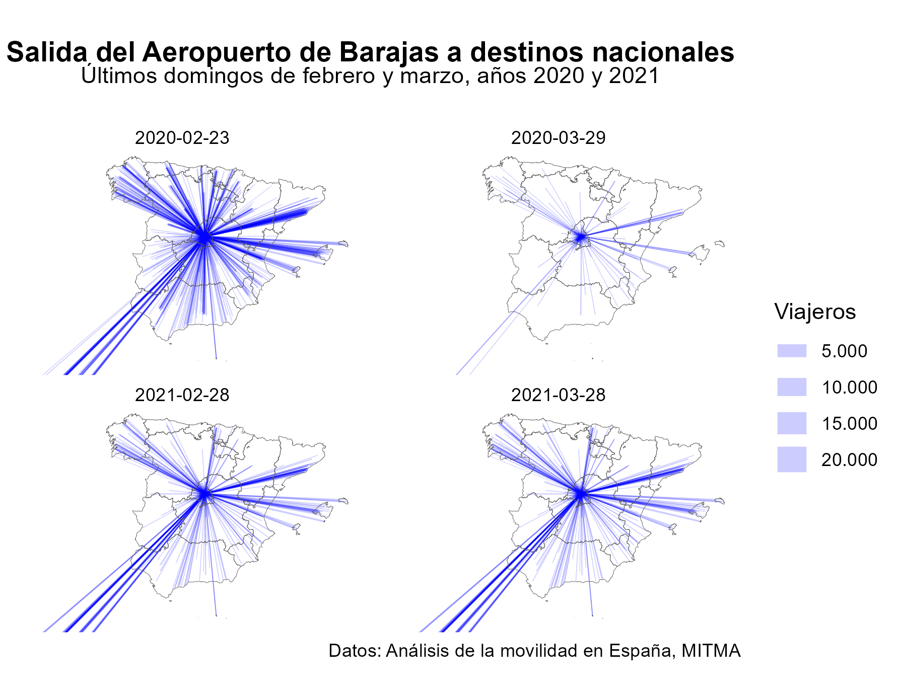

```{r knitr_config_geodata_rev, message=FALSE, warning=FALSE, include=FALSE}
knitr::opts_chunk$set(
  collapse = TRUE,
  comment = "#>",
  warning = FALSE,
  message = FALSE,
  tidy = "styler",
  out.width = "60%",
  fig.align = "center",
  dev = "ragg_png",
  dpi = 300
)
```

Que estamos en la la *era del dato*, que los *datos son el petroleo del siglo
XXI* y que estamos rodeados de datos es una cuestión que ya hemos hecho
inherente a nosotros. Vivimos en el momento del dato, donde la profesión de
*Data Scientist* se ha convertido en la **profesión más sexy del siglo XXI**
según vaticinó en 2012 [Harvard Business
Review](https://hbr.org/2012/10/data-scientist-the-sexiest-job-of-the-21st-century).
Cada segundo se producen 1,7 MB de datos/persona y cada año esta cifra se
duplica se duplica.

Este incremento exponencial de los datos ha sido posible, sin duda, gracias al
desarrollo de la tecnología, la informática, los ordenadores, los teléfonos
móviles móviles, los satélites, internet, etc... y asociado a estas nuevas
herramientas, se ha producido una lluvia sin precedentes hasta el momento de
**datos espaciales** o **datos georreferenciados**. Cada teléfono inteligente
tiene un **Receptor de posicionamiento Global** (en inglés, *Global Positioning
System*, **GPS**) y una multitud de sensores en dispositivos que van desde
satélites y vehículos semi-autónomos hasta científicos ciudadanos que miden
incesantemente cada parte del mundo. La tasa de datos producidos es abrumadora.
Un vehículo autónomo, por ejemplo, puede generar 100 GB de datos por día (The
Economist, 2016).

Esta **revolución de los geodatos** y el **análisis de los datos espaciales**
junto con los **Sistemas de Infomación Geográficos** (habitualmente expresados
como **GIS** por las siglas de su nombre en inglés *Geographical Information
System*) no sólo han impulsado la demanda de hardware informático de alto
rendimiento y software escalable y eficiente para manejar y extraer la
información, lo que se conoce como **Geocomputación**, sino que han dado lugar
una nueva rama de conocimiento, **Ciencia de Datos Espaciales** comunmente
conocida como *Spatial Data Scicene* (SDS).

Como ejemplo, de este abrumador desarrollo de datos georreferenciados, el
Ministerio de Transportes, Movilidad y Agenda Urbana llevó a cabo durante los
años 2020 y 2021 el denominado [Estudio de movilidad con Big
Data](https://www.mitma.gob.es/ministerio/covid-19/evolucion-movilidad-big-data),
cuya fuente principal de datos fue el posicionamiento de los teléfonos móviles
anonimizado. Estos datos permiten, por ejemplo, analizar la movilidad entre
diversas zonas del territorio español de manera diaria (véase Fig
\@ref(fig:mov)) Este tipo de análisis era impensable hace tan solo unos años.

```{r mov, echo=FALSE, fig.cap="Análisis de movilidad COVID"}


```
