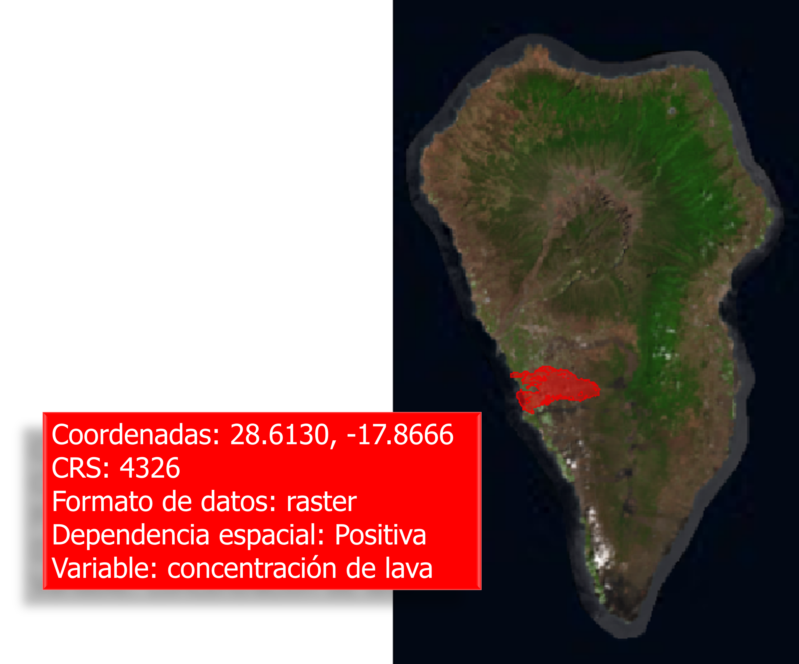

# Datos geográficos

## Contexto general

La palabra geográfico puede dividirse en **geo** (tierra) + **gráfico**
(dibujo/mapa). Por tanto, los datos geográficos contienen información de
cualquier variable referenciada en un punto/área de la superficie terrestre y
pueden representarse en mapas. El desarrollo de los datos geográficos ha
producido grandes bases de datos espaciales y, a su vez, ha propiciado el
desarrollo de herramientas para su tratamiento como los ya mencionados Sistemas
de información geográficos y la Geocomputación.

**¿Qué hace un Sistemas de información geográfico?**

Un Sistema de información geográfica (SIG) es una herramienta que crea,
administra, analiza y mapea todo tipo de datos. GIS conecta datos a un mapa,
integrando datos de ubicación (**dónde** están las cosas) con todo tipo de
información descriptiva (**cómo** son las cosas allí).

Esto proporciona una base para el mapeo y el análisis que se utiliza en la
ciencia y en casi todas las industrias. GIS ayuda a los usuarios a comprender
patrones, relaciones y contexto geográfico. Los beneficios incluyen una mejor
comunicación y eficiencia, así como una mejor gestión y toma de decisiones.

La Fig. \@ref(fig:gisflujo) muestra el flujo de trabajo de los SIG, que va desde
(i) la elaboración de mapas, (ii) la obtención de geodatos o datos espaciales,
(iii) el análisis de los datos geográficamente referenciados y (iv) la edición,
mapeo y presentación de los resultados.

```{r gisflujo, echo=FALSE, fig.align='center', fig.cap='Flujo de trabajo de los GIS. Fuente: https://www.esri.com/en-us/what-is-gis/overview', out.width="70%"}

```

Pero es más, el desarrollo de la **Inteligencia Artificial** y la **Inteligencia
computacional** se han convertido en herramientas creativas y complemenarías a
los convencionales GIS, dando origen a la *Geocomputación*, que trata de
utilizar el *poder de los ordenadores para hacer cosas con los datos
geográficos*.

**¿Y que es la Geocomputación?**

En primer lugar, señalar que, aunque la geocomputación es un término
relativamente nuevo se encuentra influenciado por otros términos clásicos. De
manera sencilla puede definirse como *"el proceso de aplicar tecnologías de
computación a problemas geográficos"* [@rees1998]. @Openshaw_Abrahart_2000
aporta más elementos formales a esta definición destacando que *"la
geocomputación trata sobre los diferentes tipos de geodatos, y sobre el
desarrollo de geo-herramientas relevantes en un contexto científico"*.

La geocomputación está muy relacionada con otros términos como los SIG, ya
definidos, y con diversos tipos de campos científicos, como las Geociencias, las
Ciencias atmosféricas y climáticas, la Geoinformática, la Topología, la Ecología
y las Ciencia de datos geográficos (GDS, Geographic Data Science).

Cada término comparte un énfasis en un enfoque **científico** (que implica
reproducible y falsable) influenciado por los GIS, aunque sus orígenes y
principales campos de aplicación difieren. La geocomputación es ámpliamente
utilizada en ámbitos como la sociología, el análisis político o el desarrollo de
aplicaciones para móviles. Por tanto, usamos geocomputación como un sinónimo
aproximado que encapsula a todas las ciencias que buscan usar datos geográficos
para trabajos científicos aplicados.

**¿Por que R para datos geográficos?**

R es una herramienta con capacidades avanzadas de análisis, modelado y
visualización. Por ejemplo, los nuevos entornos de desarrollo integrado (en
inglés, Integrated Development Environment, **IDE**), como RStudio, han hecho
que R sea más fácil de usar para muchos, facilitando la creación de mapas con un
panel dedicado a la visualización interactiva [@Lovelance_et_al_2019]. Además,
el uso del código R permite la enseñanza de la geocomputación con referencia a
ejemplos reproducibles en lugar de conceptos abstractos. Por ejemplo, de una
forma relativamente sencialla, se puede geoposicionar de manera interactiva la
localización de la Puerta del Sol en Madrid y, además, dejar la el código R para
hacerlo reproducible, ver Fig. \@ref(fig:leaflet).

```{r leaflet,  fig.align='center',  fig.cap='Localización interactiva de la Puerta del Sol en Madrid'}
library(leaflet)
leaflet(width = "100%", height = "500px") %>%
  addTiles() %>%
  setView(-3.703548, 40.417147, zoom = 60)
```

Por otra parte R dispone de cientos de librerías especializadas para datos
espaciales. Una descripción detallada puede ver se en [CRAN Task View: Analysis
of Spatial Data](https://cran.r-project.org/web/views/Spatial.html)

Para no abrumar al lector, a continuación se muestran, de manera esquemática,
las librerías más usadas para el tratamiento de datos espaciales y que se
emplearán a lo largo de la asignatura Estadística Espacial y Espacio-Temporal,
no sólo en el tema que nos ocupa:

-   `sp` y `sf`: para el tratamiento de clases y métodos de los datos
    vectoriales.

-   `raster`,`terra` y `stars` para datos raster.

-   `gstat` y `geoR`: para el análisis de datos geoestadísticos, ajuste y
    estimación de semivariogramas, interpolación, etc.

-   `spdep` para el análisis de datos con modelos de econometría espacial,
    creación de matrices de contiguidad/distancia **W**, estimación de modelos
    econométricos espaciales, etc

-   `spatstat` para el análisis de procesos de puntos espaciales, inensidad,
    etc.

## Conceptos clave

Una vez visto el contexto actual de los datos georreferenciados y antes de
entrar en detalle en su análisis, debemos tener en cuenta una serie de conceptos
clave que se irán desarrollando a lo largo del tema.

Hemos dicho que Geográfico = Geo (tierra) + gráfico (mapa). Por tanto, si
tenemos varios datos geográficos, localizados en distintos puntos de la tierra,
es porque tenemos las **coordenadas** que los posicionan en esos puntos
concretos. Asociado a estas coordenadas debemos conocer el **Sistema de
referencia de espacial** o Coordinate reference system (CRS) en el que están
proyectadas dichas coordenadas.

Por otra parte, los formatos de estos datos pueden ser **vectores** o **raster**
como se explicará en la Sección \@ref(formatos).

Si damos un paso más e incorporamos el concepto de **distancia**, pues es lógico
pensar que en un fenómeno de interés, por ejemplo, la modelización de la
cantidad y dirección de lava en La Palma tras la erupción del volcán "Cumbre
Vieja", la distancia es un factor clave, pues aquellas zonas más cercanas al
volcán tendrán niveles más parecidos entre sí y con valores más altos que
aquellas que están más alejadas

En este caso el nivel de contaminación en el aire en La Palma no puede ser
modelado como si las observaciones fuesen independientes pues las más cercanas
entre sí serán más parecidas que las más lejanas, dando lugar al concepto de
**dependencia espacial**. Y depende del tipo de datos espaciales tendremos tres
grandes formas de abordar el tratamiento de los datos espaciales:
**geoestadística**, **procesos de punto** y **econometría espacial** (véase
sección \@ref(CRS)).

```{r gis, echo=FALSE, fig.align='center', fig.cap='Información espacial de la concentración de lava en Cumbre Vieja'}

```

```{r cumbrevieja, echo=FALSE, eval=FALSE}
library(sf)
library(mapSpain)

lava <- nominatimlite::geo_address_lookup_sf("13249829",
  type = "R",
  points_only = FALSE
)

# Get La Palma bbox----

palma <- esp_get_nuts(region = "ES707", moveCAN = FALSE, epsg = 4326)

tile <- esp_getTiles(palma, "PNOA",
  bbox_expand = 0.15
)

terra::plotRGB(tile)
plot(st_geometry(lava),
  add = TRUE, col = adjustcolor("red",
    alpha.f = 0.5
  ),
  border = adjustcolor("red2",
    alpha.f = 0.8
  ), lwd = .5
)
```
