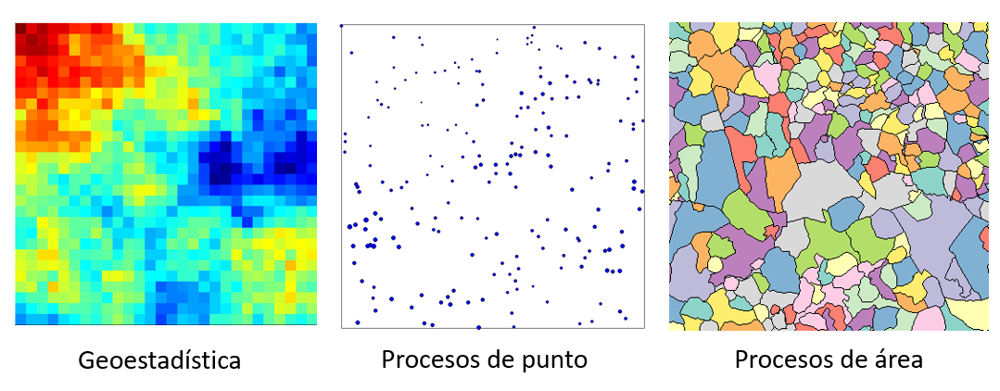
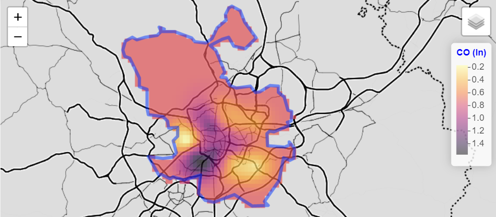
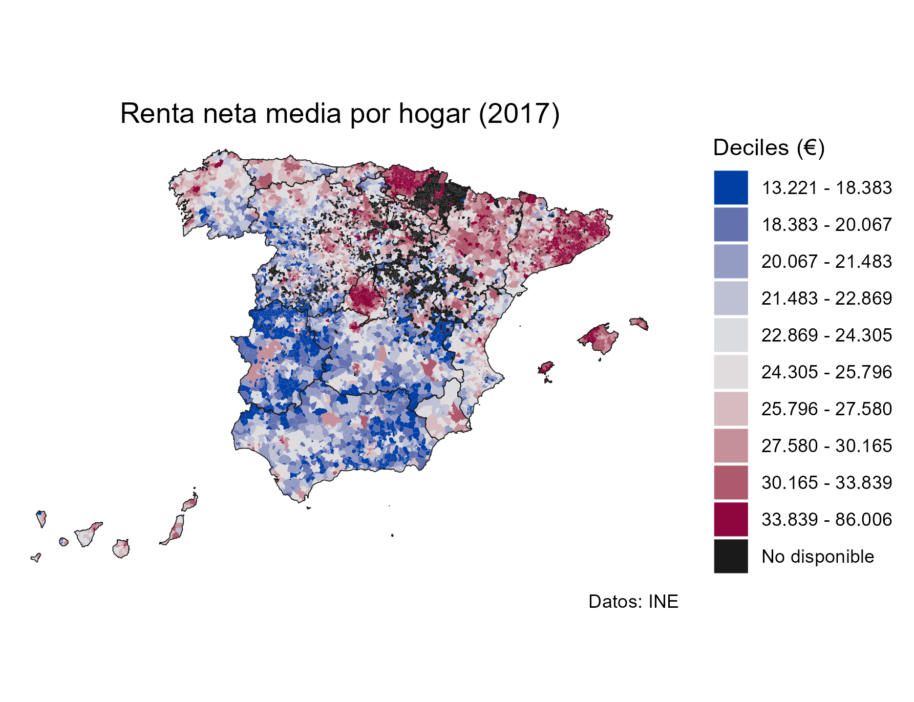
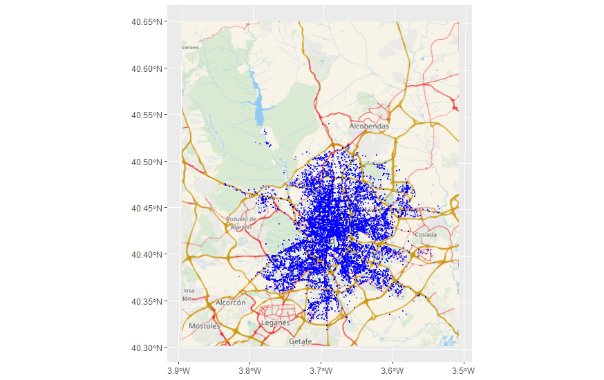

# Estadística espacial {#dep-esp}

La estadística espacial se basa en la suposición de que las unidades
georreferenciadas cercanas están relacionadas (son **dependientes**) de alguna
manera [@getis_1999], y por ello, trata de reconocer y aprovechar ésta ubicación
espacial a la hora de diseñar, recopilar, gestionar, analizar y mostrar las
observaciones (@montero_et_al_2011).

Los métodos estadísticos espaciales que se utilizan actualmente, y sobre los que
continúan las investigaciones, incluyen el estudio de la asociación espacial, el
análisis de patrones, la escala y la zonificación, la geoestadística, la
clasificación, el muestreo espacial y la econometría espacial. Estos métodos se
aplican a una gran variedad de disciplinas científicas. Por ejemplo,
@montero_et_al_2011 destacan los siguientes. Los orígenes de la vida humana
vinculan los estudios de la evolución de las galaxias, la estructura de las
células biológicas y los patrones de asentamiento arqueológicos. Los ecologistas
estudian las interacciones entre plantas y animales. Silvicultores y
agricultores necesitan investigar las variaciones que se producen en el terreno
para sus experimentos. La estimación de las precipitaciones y de las reservas de
oro y petróleo es de vital importancia económica. Estos son, entre otros, buenos
ejemplos de la importancia del espacio (espacio-tiempo en su caso) en el mundo
de la Ciencia.

Sin embargo, el estudio de la **variabilidad espacial**, y sobre todo
espacio-temporal, es una disciplina relativamente nueva en el marco de la
Estadística, lo que explica la escasez de instrumentos de estadística espacial
30 años atrás. En los últimos 10 años ha habido una creciente toma de conciencia
de esta necesidad, habiéndose realizado un gran esfuerzo por buscar herramientas
adecuadas y útiles a tales efectos. Y todo ello porque utilizar modelos
espaciales o espacio-temporales para caracterizar y explotar la dependencia
espacial (o espacio-temporal) de un conjunto de observaciones tiene importantes
ventajas (@montero_et_al_2011):

1.  Modelos más generales, ya que, en la mayoría de los casos, los modelos
    clásicos que no tienen en consideración la dimensión espacial o la
    interacción de las dimensiones espacial y temporal son un caso particular de
    un modelo espacial o espacio-temporal.

2.  Estimaciones más eficientes: de la tendencia, de los efectos de las
    variables explicativas, de promedios regionales,...

3.  Mejora de las predicciones: más eficientes, con propiedades de extrapolación
    más estables,...

4.  La variación espacial no explicada en la estructura de la media debe ser
    absorbida por la estructura del error, por lo que un modelo que incorpore la
    dependencia espacial puede decirse que está protegido frente a una mala
    especificación de este tipo. Esto, en muchos casos, tiene como resultado una
    simplificación en la especificación de la tendencia; en general, los modelos
    con dependencia espacial suelen tener una descripción más parsimoniosa (en
    ocasiones con muchos menos parámetros) que los clásicos modelos de
    superficie de tendencia.

## Antes de continuar... dependencia espacial.

Frecuentemente los datos tienen una componente espacial y/o temporal asociada a
ellos y es de esperar que datos cercanos en el espacio o en el tiempo sean más
semejantes que aquellos que están más alejados; en cuyo caso **no** deben ser
modelados como estadísticamente independiente, sino que habrá que tomar en
cuenta esa dependencia espacial o espacio-temporal.

De forma natural y de acuerdo a la Ley Tobler [@tobler1970] surge la idea de que
los datos cercanos en el espacio o en el tiempo serán más similares y estarán
más correlacionados entres sí que aquellos que están más lejanos. Por ejemplo,
la influencia de un terremoto, su efecto disminuye con distancia del epicentro.
Además, esta correlación disminuye al aumentar la separación entre ellos, por lo
que se puede pensar en la presencia de una dependencia espacial o
espacio-temporal.

Si los datos no exhiben dependencia espacial no tiene sentido aplicar las
herramientas de estadística espacial. ¿Y cómo se pueden reconocer un proceso con
dependencia espacial? La clave esta en que los procesos con dependencia espacial
exhiben un patrón en el espacio, mientras que los que son independientes son
totalmente aleatorios.

La Fig. \@ref(fig:points-depiid) muestra uno campo aleatorio simulado que
presentan una estructura de dependencia espacial (panel izquierdo) frente a unos
datos totalmente aleatorios (panel derecho), en ambos casos distribuidos de
forma irregular en el espacio. En la imagen de dependencia espacial se observa
como los puntos rojos (que representan valores más altos de la variable
simuladas) se concentran en la misma zona, al igual que los puntos azules (que
representan valores más bajos) que se distribuyen en otra zona y juntos.

```{r points-depiid, echo=FALSE, message=FALSE, warning=FALSE, fig.cap="Puntos: Simulación patrón de independencia espacial (derecha) frente a dependencia espacial (izquierda)"}
library(geoR)
library(fields)

par(mfrow = c(1, 2))

set.seed(2022)
sim1 <- grf(201, cov.pars = c(1, 0.6), messages = FALSE)
points.geodata(sim1,
  main = "Dependencia espacial (positiva)",
  col = tim.colors(), cex.max = 3
)

# Independencia
set.seed(2022)
sim3 <- grf(201, cov.pars = c(0.01, 0), messages = FALSE)
points.geodata(sim3,
  main = "Independencia",
  col = tim.colors(), cex.max = 3
)
```

La Fig. \@ref(fig:lattice-dep-iid), al igual que la Fig.
\@ref(fig:points-depiid) presenta unos datos simulados donde que muestran una
estructura de dependencia espacial (panel izquierdo) frente a unos datos
totalmente aleatorios (panel derecho), pero en este caso estos datos se
distribuyen de forma ordenada en el espacio a través de una rejilla regular. La
interpretación es análoga a la de la Fig. \@ref(fig:points-depiid), solo que en
este caso los campos aleatorios simulados se representan en una rejilla.

```{r lattice-dep-iid, echo=FALSE, message=FALSE, warning=FALSE, fig.cap="Rejilla: Simulación patrón de independencia espacial (derecha) frente a dependencia espacial (izquierda)"}
par(mfrow = c(1, 2))
set.seed(2022)
sim2 <- grf(441, grid = "reg", cov.pars = c(1, 0.25), messages = FALSE)
image(sim2,
  main = "Dependencia espacial (positiva)",
  col = tim.colors()
)


# Independencia
set.seed(2022)
sim4 <- grf(441, grid = "reg", cov.pars = c(0.01, 0), messages = FALSE)
image(sim4, main = "Independencia", col = tim.colors())
```

## Datos espaciales

Los **datos espaciales**, también conocidos como datos **geoespaciales**, son
aquellos datos relacionados o que contienen información de una localización o
área geográfica de la superficie de la Tierra.

La forma más intuitiva de representar los datos espaciales es a través de un
mapa.

```{r mapa-clm, fig.cap="Porcentaje de Mujeres en Castilla-La Mancha"}
# Mapa de porcentaje de mujeres en Castilla-La Mancha

library(mapSpain)

# Datos de población
pob <- mapSpain::pobmun19


# Datos en forma de tabla, sin información en formato espacial
# head(pob)

# Porcentaje
pob$porc_mujeres <- pob$women / pob$pob19 * 100

# Datos espaciales
geo <- esp_get_munic(region = "Castilla-La Mancha")

# Estos datos tienen una columna (geometry) con coordenadas.
# head(geo)

# Une ambos datos
geo_pob <- merge(geo,
  pob,
  by = c("cpro", "cmun"),
  all.x = TRUE
)

# Mapa básico
plot(geo_pob["porc_mujeres"],
  # Cambiamos titulo
  main = "Castilla-La Mancha: % mujeres (2019)",

  # Cambiamos la paleta de colores para hacerlo mas atractivo
  # border = NA,
  pal = hcl.colors(12, "RdYlBu")
)
```

La Fig. \@ref(fig:mapa-clm) presenta una serie de elementos gráficos,
característicos de los objetos espaciales:

-   Los municipios de Castilla-la Mancha están representados por polígonos con
    un contorno negro y se rellenan de colores de acuerdo con la variable que
    estamos analizando, el porcentaje de mujeres en los municipios de
    Castilla-La Mancha en el año 2019.

-   Una leyenda explica el significado de los colores.

-   La variable, el porcentaje de mujeres en los municipios de Castilla-La
    Mancha en el año 2019, no parece distribuirse de manera independiente sino
    todo lo contrario, muestra un patrón espacial. Los municipios de las
    provincias Guadalajara y Cuenca (noreste) presentan tasas más bajas que los
    municipios del centro de la Comunidad.

```{r clm_tabla}
head(geo_pob["porc_mujeres"])
```

Antes de dibujar la Fig. \@ref(fig:mapa-clm) tuvimos que leer los datos de la
librería **mapSpain** [@rmapspain] que contenía tanto la variable que hemos
analizado como el formato del mapa. Tras unir variable y mapa con la función
`merge()`. Al llevar a cabo un resumen del objeto espacial nos encontramos con
la siguiente información:

-   el conjunto de datos (seleccionado) tiene 919 registros (municipios)
-   el tipo de geometría es POLYGON.
-   el CRS es ETRS89

## Clasificación de datos espaciales

Tal y como acabamos de señalar y de acuerdo con @Schabenberger_Gotway_2005, p.
6), debido a que los datos espaciales surgen en una gran variedad de campos y
aplicaciones, también hay una gran variedad de tipos de datos espaciales,
estructuras y escenarios. Por tanto, una clasificación exhaustiva de los datos
espaciales sería un reto muy difícil y hemos apostado por una clasificación
general, simple y útil de datos espaciales proporcionada por @cressie1993.

La **clasificación** de Cressie de datos espaciales se basa en la naturaleza del
dominio espacial en estudio. Dependiendo de esto, podemos tener: datos
geoestadísticos, datos de patrones de puntos y datos lattice (véase Fig.
\@ref(fig:hengl-cressie) en la que se han simulado los distintos procesos
espaciales).

```{r hengl-cressie-simulada, echo=FALSE, fig.align='center', eval=FALSE, }

# Geostadísitca

library(geoR)
library(fields)
set.seed(123)
sim2 <- grf(800, grid = "reg", cov.pars = c(1, 0.5), messages = FALSE)
image(sim2, col = tim.colors())


### ppp

set.seed(111)
sim2 <- grf(200, cov.pars = c(1, 0.5), messages = FALSE)
points.geodata(sim2, col = "blue")

### lattice

library(mapSpain)
clm <- esp_get_munic(region = "Castilla-La Mancha")
plot(clm["cmun"])
```

```{r hengl-cressie, echo=FALSE, fig.align='center', fig.cap='Clasificación de datos espaciales propuesta por Cressie (1993))'}

```

Siguiendo a @cressie1993, sea $s ∈ ℝ^d$ una localización en un espacio Euclideo
$d-$dimensional y ${Z(s)∶ s ∈ ℝ^d}$ una función aleatoria espacial, donde $Z$
representa el atributo en el cual estamos interesados, se tendría la siguiente
clasificación [@montero_et_al_2015]:

1.  **Datos geoestadísticos:** Surgen cuando el dominio de estudio es **continuo
    y fijo** $D$. Es decir: (i) $Z(s)$ se puede observar en cualquier punto del
    dominio (continuo); y (ii) los puntos en $D$ no son estocásticos (son fijos,
    $D$ es el mismo para todas las realizaciones de la función aleatoria
    espacial).

    Algunos ejemplos de datos geoestadísticos son el nivel de un contaminante en
    una ciudad, los valores de precipitación o temperatura del aire en un país,
    las concentraciones de metales pesados en la capa superior del suelo de una
    región, etc.

    Es obvio que, al menos en teoría, el nivel de un contaminante específico
    podría medirse en cualquier lugar de la ciudad; Lo mismo puede decirse de
    las mediciones de precipitaciones o temperaturas del aire en un país o
    concentraciones de un metal pesado en una región. Sin embargo, en la
    práctica, no es posible una observación exhaustiva del proceso espacial. Por
    lo general, el proceso espacial se observa en un conjunto de ubicaciones
    (por ejemplo, el nivel de un contaminante específico en una ciudad se
    observa en los puntos donde están ubicadas las estaciones de monitoreo) y,
    basado en tales valores observados, el análisis geoestadístico reproduce el
    comportamiento de el proceso espacial en todo el dominio de interés. La Fig.
    \@ref(fig:ejem-geo) presenta un mapa de interpolación krigeado del nivel de
    monoxido de carbono (CO) en logaritmos para la ciudad de Madrid.

    En el análisis geoestadístico lo más importante es cuantificar la
    correlación espacial entre observaciones (a través de la herramienta básica
    en geoestadística, el semivariograma) y utilizar esta información para
    lograr los objetivos anteriores (véase @montero_et_al_2015 para un análisis
    profundo de los métodos geoestadísticos espaciales y espacio-temporales}.

```{r ejem-geo, echo=FALSE, fig.align='center', fig.cap='Mapa de interpolación del nivel de CO en el aire en la ciudad de Madrid'}


```

2.  **Datos reticulares**: Surgen cuando: (i) el dominio bajo estudio $D$ es
    **discreto**, es decir, $Z(s)$ puede observarse en una serie de ubicaciones
    fijas que pueden enumerarse. Estas ubicaciones pueden ser puntos o regiones,
    pero generalmente son códigos postales, pistas censales, vecindarios,
    provincias, países, etc., y los datos en la mayoría de los casos son datos
    agregados espacialmente sobre estas áreas. Aunque estas regiones pueden
    tener una forma regular, normalmente la forma que tienen es irregular, y
    esto, junto con el carácter espacialmente agregado de los datos, es por lo
    que los datos latice tambien se denominan datos regionales. Y (ii) las
    ubicaciones en $D$ no son estocásticas. Por supuesto, un concepto clave en
    el análisis de los datos lattice es el **vecindario** y la matriz **W**.

    Algunos ejemplos de reticulares incluyen la tasa de desempleo por estados,
    los datos de delincuencia por comarcas, rendimientos agrícolas en parcelas,
    precios medios de la vivienda por provincias, etc. En este sentido un
    ejemplo ilustrativo se presenta en la la Fig. \@ref(fig:ejem-lattice), que
    muestra la distribución municipal de la renta neta media por hogar en 2017
    en España.

```{r ejem-lattice, echo=FALSE, fig.align='center', fig.cap='Renta neta media municipal española en 2017'}

```

3.  **Procesos de puntos:** Mientras que en los datos geoestadísticos y
    reticulares el dominio $D$ es fijo, en los datos de patrones puntuales el
    dominio es discreto o continuo, pero **aleatorio**. Los patrones de puntos
    surgen cuando el atributo bajo estudio es la ubicación de los eventos
    (observaciones). Es decir, el interés radica en dónde ocurren eventos de
    interés.

    Algunos ejemplos de patrones de puntos son la ubicación de incendios en una
    región española, la ubicación de los árboles en un bosque o la ubicación de
    nidos en una colonia de aves reproductoras, la localización de los
    accidentes de tráfico en una ciudad o área de referencia, la localización de
    los delitos en una ciudad, entre muchas otras.

    En estos En los casos, es obvio que $D$ es aleatorio y los puntos de
    observación no dependen del investigador. El principal objetivo del análisis
    de patrones de puntos es determinar si la ubicación de los eventos tiende a
    exhibir un patrón sistemático sobre el área en estudio o, por el contrario,
    son aleatoriamente repartido.

    Más concretamente, nos interesa analizar si la ubicación de los eventos es
    completamente aleatoria espacialmente (la ubicación donde ocurren los
    eventos no se ve afectada por la ubicación de otros eventos), uniforme o
    regular (cada punto está tan lejos de todos sus vecinos como sea posible) o
    agrupados o agregados (la ubicación de los eventos se concentra en grupos).
    La Fig. \@ref(fig:ejem-pp) muestra la localización de los accidentes de
    tráfico registrados en la ciudad de Madrid durante el mes de febrero
    de 2020.

```{r ejem-pp, echo=FALSE, fig.align='center', fig.cap='Accidentes de tráfico registrados en la ciudad de Madrid (Febrero de 2020)'}

```
