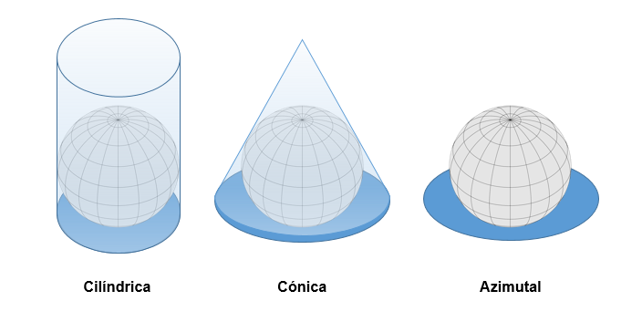
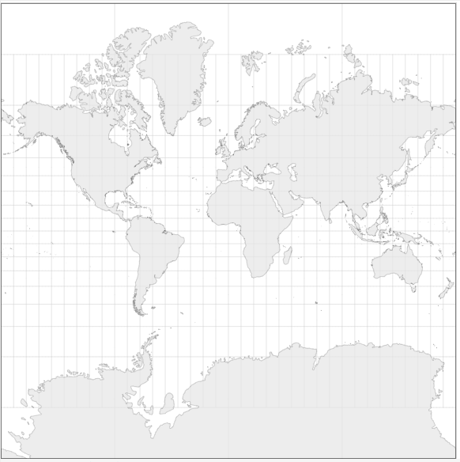
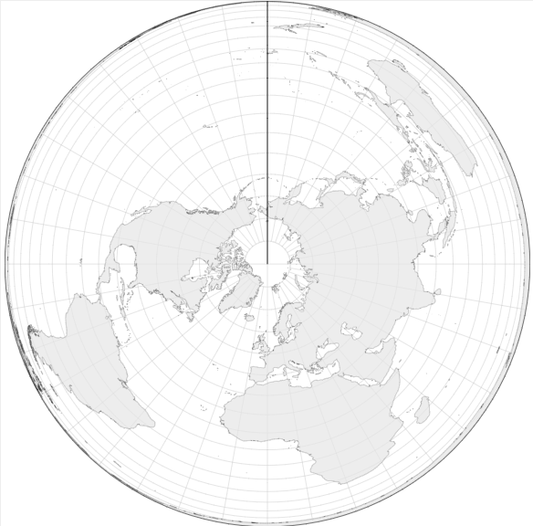
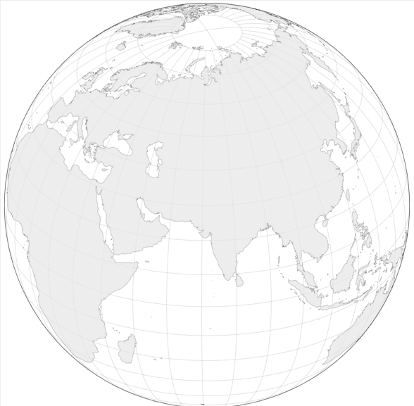
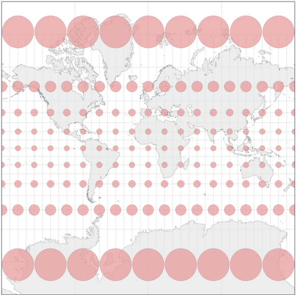
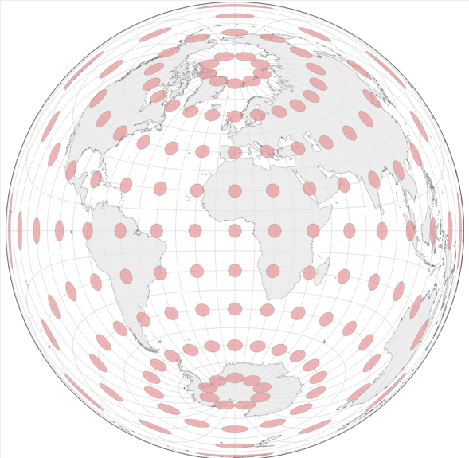
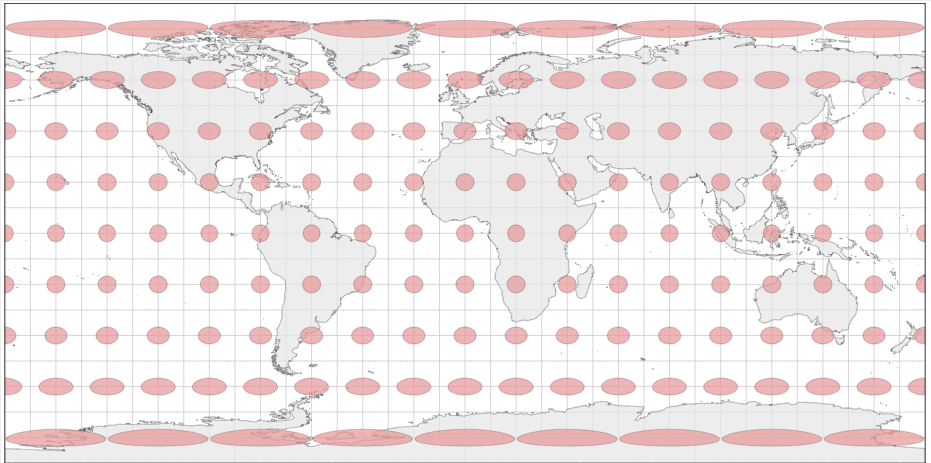
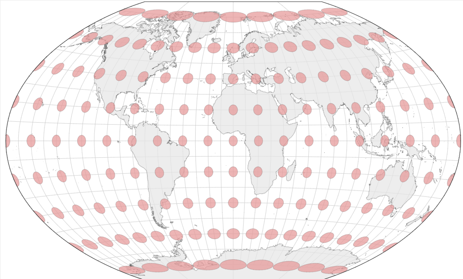

```{r setup, include=FALSE}
knitr::opts_chunk$set(
  collapse = TRUE,
  comment = "#>",
  warning = FALSE,
  message = FALSE,
  tidy = "styler",
  out.width = "60%",
  fig.align = "center",
  dev = "ragg_png",
  dpi = 300
)
```

Un sistema de referencia de coordenadas (o CRS por sus siglas en inglés,
**Coordinate Reference System**) permite relacionar datos espaciales con su
localización en la superficie terrestre. Los CRS constituyen por tanto un
aspecto fundamental en el análisis y representación de datos espaciales, ya que
nos permiten identificar con exactitud la posición de los datos sobre el globo
terráqueo.

Así mismo, cuando se trabaja con datos espaciales provenientes de distintas
fuentes de información, es necesario comprobar que dichos datos se encuentran
definidos en el mismo CRS:

```{r datosdesalineados, echo=FALSE, fig.cap="Representación de mismos valores de coordenadas en distintos CRS"}

library(giscoR)
library(nominatimlite)
library(sf)


# Mundo en WGS84
world <- gisco_get_countries(epsg = 4326)

# Toledo  en WGS84
toledo <- geo_lite_sf("Toledo, Spain")

toledo_ok <- st_transform(toledo, st_crs(4326))

# Fuerza error sobreescribiendo (no transformando) coordenadas
toledo_err <- toledo_ok
st_crs(toledo_err) <- st_crs(3857)

plot(st_geometry(world),
  ylim = c(-10, 80),
  xlim = c(-20, 20), axes = TRUE
)
plot(st_geometry(toledo_ok),
  add = TRUE, bg = "green", color = "black", pch = 21, cex = 2
)

# Aún necesito transformarlo para crear el plot
plot(st_geometry(st_transform(toledo_err, st_crs(4326))),
  add = TRUE, bg = "red", color = "black", pch = 21, cex = 2
)
title("Ejemplo: Mismas coordenadas en distintos CRS")
```

En el ejemplo anterior, ambos puntos (verde y rojo) presentan los mismos valores
de coordenadas en los ejes X e Y, en este caso las correspondientes a la ciudad
de Toledo.

Sin embargo, presentan distintos CRS. Por este motivo, al representar ambos
puntos en un mapa, se observa que no se están refiriendo a la misma localización
geográfica. Esto es así porque el CRS define la referencia (punto x=0 e y =0) y
las unidades de los ejes (grados, metros, millas).

Como conclusión, **además de disponer de las coordenadas de los datos
espaciales, es necesario conocer el CRS en el que están definidos para conocer
de manera exacta su localización geográfica.** Además, nótese que para cualquier
**análisis de datos espaciales** es necesario que todos los geodatos **se
encuentren referenciados en el mismo CRS**. Esto se consigue transformando (o
proyectando) los datos a un CRS común, nunca sobreescribiendo el CRS de los
mismos.

### Tipos de CRS

A continuación se definen los dos grandes tipos de CRS, los CRS geográficos y
los CRS proyectados.

#### CRS geográficos

Los CRS geográficos son aquellos en los que los parámetros empleados para
localizar una posición espacial son la latitud y la longitud:

-   **Latitud**: Es la distancia angular expresada en grados sobre el plano
    definido por el ecuador terrestre. Determina la posición sobre de una
    localización en el eje Norte-Sur de la Tierra y toma valores en el rango
    $[-90º,90º]$ . Las líneas imaginarias determinadas por una sucesión de
    puntos con la misma latitud a lo largo del eje Este-Oeste se denominan
    **paralelos**:

```{r paralelos, echo=FALSE, fig.cap="Paralelos terrestres"}

library(sf)
library(s2)
library(giscoR)
library(dplyr)

g <- as_s2_geography(TRUE)

mundo_init <- gisco_get_coastallines(
  epsg = 4326,
  resolution = 20
)

mundo <- mundo_init %>%
  st_as_s2()

# Parte visible
b <- s2_buffer_cells(
  as_s2_geography("POINT(10 10)"),
  9800000
)

# Lineas de latitud
all <- st_graticule(
  crs = st_crs(4326),
  ndiscr = 300
)
lat <- all %>% filter(type == "N")
ecuador <- lat %>% filter(degree == 0)

# Crea modelo de Tierra esférica
mundo_v <- s2_intersection(b, mundo)
lat_v <- s2_intersection(b, lat)
ecuador_v <- s2_intersection(b, ecuador)

# Proyecta a ortogonal
orto_crs <- st_crs("+proj=ortho +lat_0=10 +lon_0=10")

mundo_ort <- st_as_sfc(mundo_v) %>% st_transform(orto_crs)
lat_orto <- st_as_sfc(lat_v) %>%
  st_transform(orto_crs) %>%
  st_as_sf(st_drop_geometry(lat), .) %>%
  mutate(label = paste0(degree, "º"))
ecuador_orto <- st_as_sfc(ecuador_v) %>%
  st_transform(orto_crs) %>%
  st_as_sf(label = "Ecuador")
b_orto <- st_as_sfc(b) %>% st_transform(orto_crs)


library(ggplot2)

paralelos <- ggplot(mundo_ort) +
  geom_sf(fill = "grey95", color = NA) +
  geom_sf(data = b_orto, fill = NA) +
  geom_sf(data = lat_orto, linetype = "dashed") +
  geom_sf(data = ecuador_orto, aes(color = label), size = 1.5) +
  geom_sf_text(
    data = lat_orto, aes(label = label),
    nudge_x = -180 * 10000,
    nudge_y = 40 * 10000,
    size = 3
  ) +
  scale_color_manual(values = "blue", name = "") +
  coord_sf(
    lims_method = c("geometry_bbox")
  ) +
  theme_void() +
  theme(
    plot.title = element_text(hjust = .5, face = "bold"),
    legend.position = "top"
  ) +
  labs(title = "Líneas de Latitud o Paralelos")
```

-   **Longitud**: Es la distancia angular expresada en grados sobre el plano
    definido por el meridiano de Greenwich. Determina la posición sobre de una
    localización en el eje Este-Oeste de la Tierra y toma valores en el rango
    $[-180º,180º]$ . Las líneas imaginarias determinadas por una sucesión de
    puntos con la misma longitud a lo largo del eje Este-Oeste se denominan
    **meridianos**:

```{r meridianos, echo=FALSE, fig.show="hold", out.width="50%", fig.cap="Paralelos y Meridianos terrestres"}
lon <- all %>% filter(type == "E")
greenwich <- lon %>% filter(degree == 0)

lon_v <- s2_intersection(b, lon)
greenwich_v <- s2_intersection(b, greenwich)

lon_orto <- st_as_sfc(lon_v) %>%
  st_transform(orto_crs) %>%
  st_collection_extract("LINESTRING")

greenwich_orto <- st_as_sfc(greenwich_v) %>%
  st_transform(orto_crs) %>%
  st_collection_extract("LINESTRING") %>%
  st_as_sf(label = "Meridiano de Greenwich")

# Labels, donde corten los meridianos con el Ecuador
labs_geo <- st_intersection(lon_orto, ecuador_orto)
labs <- st_sf(label = paste0(seq(-60, 80, 20), "º"), labs_geo)

merid <- ggplot(mundo_ort) +
  geom_sf(fill = "grey95", color = NA) +
  geom_sf(data = b_orto, fill = NA) +
  geom_sf(data = lon_orto, linetype = "dashed") +
  geom_sf(data = greenwich_orto, aes(color = label), size = 1.5) +
  geom_sf_text(
    data = labs, aes(label = label),
    nudge_x = -40 * 10000,
    nudge_y = 100 * 10000,
    size = 3
  ) +
  scale_color_manual(values = "blue", name = "") +
  coord_sf(
    lims_method = c("geometry_bbox")
  ) +
  theme_void() +
  theme(
    plot.title = element_text(hjust = .5, face = "bold"),
    legend.position = "top"
  ) +
  labs(title = "Líneas de Longitud o Meridianos")

paralelos
merid
```

Es muy importante destacar que en un sistema de coordenadas geográfico, es
decir, basado en latitudes y longitudes, las **distancias** entre dos puntos
representan **distancias angulares**. Por ejemplo, la distancia entre el
meridiano de Greenwich y el meridiano correspondiente a la longitud 20º siempre
es de +20º. Sin embargo, debido a la forma esférica de la Tierra, la longitud en
metros entre ambos meridianos no es constante:

```{r distang, echo=FALSE, fig.cap="Distancia entre meridianos en distintas latitudes" }

# Selecciona lineas
l0 <- st_linestring(matrix(c(0, 20, 0, 0), nrow = 2)) %>%
  st_sfc(crs = st_crs(4326)) %>%
  st_segmentize(300)

l60 <- st_linestring(matrix(c(0, 20, 60, 60), nrow = 2)) %>%
  st_sfc(crs = st_crs(4326)) %>%
  st_segmentize(300)


# Une lineas
geom <- c(l0, l60)

# Data frame
df <- st_sf(dist = as.numeric(st_length(geom)) / 1000, geom)
df_ortho <- st_transform(df, st_crs(lon_orto))
df_ortho$dist <- paste(prettyNum(round(df_ortho$dist, 0),
  big.mark = ","
), "km")


p <- merid +
  geom_sf(data = df_ortho, color = "red", size = 2) +
  geom_sf_label(
    data = df_ortho, aes(label = dist), size = 4.5,
    color = "red",
    nudge_x = 300 * 10000
  ) +
  theme(
    legend.position = "none",
    plot.subtitle = element_text(hjust = .5)
  ) +
  labs(
    title = "Distancia entre meridianos",
    subtitle = "En latitud 0º y 20ºN"
  )

p
```

#### CRS proyectados

La representación de formas tridimensionales en un soporte plano (dos
dimensiones) presenta algunos retos. Por ello, es habitual trabajar con
proyecciones de mapas.

Una proyección geográfica es un método para reducir la superficie de la esfera
terrestre a un sistema cartesiano de dos dimensiones. Para ello, es necesario
transformar las coordenadas longitud y latitud en coordenadas cartesianas x e y.

Es importante destacar que las proyecciones pueden incluir un punto de origen
(X=0, Y=0) y unas unidades de distancia (habitualmente metros) específicas. Por
ejemplo, la **proyección cónica equiáreas de Albers** (específica para Estados
Unidos) define su punto de referencia (0,0) en la latitud 40º N y longitud 96º,
y la unidad de variación están definida en metros. De ahí la importancia de
conocer el CRS de los datos geográficos, como se expuso al principio de este
tema.

Existen varias familias de proyecciones, que se pueden clasificar de diversas
maneras:

**Por tipo de superficie de proyección**

El proceso de trasladar puntos de una esfera a un plano puede plantearse de
manera práctica como el ejercicio de envolver una esfera con una superificie
plana (como una hoja de papel) y trasladar los puntos de la esfera de manera
lineal al punto de la superficie plana más cercano a ella.

```{r fi-proys, echo=FALSE, fig.cap="Tipos de proyección por superficie de proyección"}


```

A partir de este ejercicio, se plantean tres posibles soluciones, dependiendo
del tipo de superficie que se use para proyectar:

-   **Proyecciones cilíndricas**: Son aquellas proyecciones donde la superficie
    de proyección conforma un cilindro alrededor de la Tierra. Una de las
    proyecciones cilíndricas más conocidas es la **proyección de Mercator**.

```{r mercator, echo=FALSE, out.width="40%", fig.cap="Proyección Mercator"}


```

-   **Proyecciones cónicas**: En este tipo de proyecciones, se plantea la
    superficie de proyección como una forma cónica. Como ejemplo, la
    **proyección cónica equiáreas de Albers** es una de las proyecciones que más
    suele usarse en la representación de mapas de América del Norte:

```{r albers, echo=FALSE, out.width="40%", fig.cap="Proyección cónica equiáreas de Albers"}


```

-   **Proyecciones acimutales o planares:** En este tipo de proyección se
    proyecta una porción de la Tierra sobre un plano que es tangente a la misma
    en el punto de referencia. Como ejemplos de proyecciones acimutales podemos
    destacar la **proyección ortográfica**:

```{r orto, echo=FALSE, out.width="40%", fig.cap="Proyección ortogonal"}


```

**Por métrica a preservar**

Es importante tener en cuenta que cualquier proyección de la superficie de la
Tierra produce distorsiones en una o varias características geográficas. Como
ejemplos clásicos, la proyección de Mercator produce distorsiones del área
especialmente en aquellas regiones más cercanas a los polos (Groenlandia, que la
proyección de Mercator presenta una área similar a la de África, presenta menor
superificie real que Argelia). Otras de las métricas que suele verse
distorsionada son la **distancia** entre dos puntos geográficos, la
**dirección** o la **forma** de regiones de la Tierra.

A lo largo de la Historia se han desarrollado diversas proyecciones cuyo
objetivo es preservar alguna o varias de las propiedades mencionadas
anteriormente, sin embargo es importante destacar que **no existe una proyección
que sea capaz de preservar todas las métricas a la vez**.

Según la metrica a presevar, las proyecciones se pueden clasificar en:

-   **Proyecciones conformales:** Estas proyecciones intentan preservar los
    ángulos que se forman en la superficie terrestre. Por ejemplo, la proyección
    de Mercator representa ángulos rectos en las intersecciones de los paralelos
    y los meridianos.

```{r conform, echo=FALSE, out.width="30%", fig.cap="Ejemplo de proyección conformal: Mercator"}


```

-   **Proyecciones equivalentes**: Estas proyecciones preservan las proporciones
    de las áreas, provocando a su vez deformaciones en el resto de
    características, como la forma o los ángulos. La proyección acimutal
    equivalente de Lambers es un tipo de proyección equivalente.

```{r equiv, echo=FALSE, out.width="30%", fig.cap="Ejemplo de proyección equivalente: Proyección acimutal equivalente de Lambers"}


```

-   **Proyecciones equidistantes:** Este tipo de proyección preserva la
    distancia entre dos puntos geográficos específicos. Por ejemplo, la
    proyección Plate carré preserva la distancia entre el Polo Norte y el Polo
    Sur.

```{r equidist, echo=FALSE, out.width="30%", fig.cap="Ejemplo de proyección equidistante: Platé carre"}


```

-   **Proyecciones de compromiso**: Este tipo de proyección no intenta preservar
    ninguna métrica en concreto. En su lugar, se centran en intentar encontrar
    un equilibrio entre las diversas distorsiones que provocan para intentar dar
    una representación más o menos representativa de la superficie terrestre. La
    proyección de Winkel Tripel, usada en los mapas de National Geographic, es
    un ejemplo de proyección de compromiso.

```{r comp, echo=FALSE, out.width="30%", fig.cap="Ejemplo de proyección de compromiso: Winkel Tripel"}


```

En los anteriores ejemplos se ha añadido a cada proyección la **indicatriz de
Tissot**. Consiste en una serie de círculos imaginarios de igual área
distribuidos sobre la superficie esférica de la Tierra en determinados puntos.
De este manera, al presentar la indicatriz de Tissot en una proyección
específica, se puede entender de una manera intuitiva la distorsión provocada
por dicha proyección, ya que los círculos se ven distorsionados o preservados
según los parámetros y la naturaleza de la proyección en cuestión.

### Trabajando con proyecciones en R

Existe toda una serie de proyecciones predefinidas, identificadas mediante los
**códigos EPSG, ESRI, WKT** o proj4 (en desuso en R, pero todavía admitidos).
Existen varios recursos web donde se pueden consultar y seleccionar los códigos
correspondientes:

-   <https://epsg.io/>

-   <https://spatialreference.org/>

-   <https://proj.org/operations/projections/index.html>

Algunos de los códigos de proyecciones que es fundamental conocer son:

-   **EPSG: 4326**: Proyección correspondiente a WGS 84, que es el sistema usado
    por los sistemas GPS. Cuando trabajemos con coordenadas geográficas
    longitud/latitud, este es habitualmente el CRS de referencia.

-   **EPSG: 3857**: Código correspondiente a la proyección de Mercator, usada
    habitualmente por servicios como Google Maps, etc.

En la sección [¿Qué proyección uso?] veremos cómo encontrar un CRS usando el
paquete `crsuggest`.

El paquete `sf` permite obtener los parámetros de estas proyecciones mediante la
función `st_crs()`:

```{r crs}

library(sf)

# Ejemplo: EPSG WGS 84 (Sistema Global GPS): EPSG 4326

st_crs(4326)

# Usando código ESRI North America Albers Equal Area Conic

st_crs("ESRI:102008")

# Usando proj4string: Robinson

st_crs("+proj=robin")
```

De esta manera, es posible proyectar un objeto `sf` mediante la función
`st_transform()`:

```{r project, fig.cap=c("Proyección del mundo en coordenadas geográficas (EPSG 4326)", "Proyección del mundo en Mercator (EPSG 3857)", "Proyección del mundo en Robinson (+proj=robin)")}

# Usa datos del paquete mapSpain

library(giscoR)

paises <- gisco_get_countries()

# Comprobamos el CRS de estos datos
# Se puede almacenar en un objeto y usar posteriormente
st_crs(paises)

# Plot
plot(st_geometry(paises), axes = TRUE)

# Proyectamos a Mercator
# El eje cambia porque Mercator usa metros
paises_merc <- st_transform(paises, st_crs(3857))
plot(st_geometry(paises_merc), axes = TRUE)

# Proyectamos a Robinson
paises_robin <- st_transform(paises, st_crs("+proj=robin"))
plot(st_geometry(paises_robin), axes = TRUE)
```

Como se comentó anteriormente, cuando se usan geodatos de diversas fuentes, es
necesario que todos presenten el mismo CRS. En este ejemplo se muestra lo que
ocurre si esto no se cumple:

```{r puertos, fig.cap=c("Ejemplo: Puertos del mundo, CRS no alineados", "Ejemplo: Puertos del mundo, CRS alineados")}
# Añadimos a este mapa puertos mundiales de giscoR

puertos <- gisco_get_ports()
plot(st_geometry(paises_robin), main = "Puertos en el mundo")
plot(st_geometry(puertos), add = TRUE, col = "red", pch = 20)


# Ha habido algun error... Comprueba CRS

st_crs(puertos) == st_crs(paises_robin)

# Los puertos no están en Robinson! Proyectamos al mismo CRS
puertos_robin <- st_transform(puertos, st_crs(paises_robin))
plot(st_geometry(paises_robin), main = "Puertos en el mundo")
plot(st_geometry(puertos_robin), add = TRUE, col = "blue", pch = 20)
```

Como vemos, en el primer mapa los puertos se concentran en un único punto, dado
que no están referenciados en el mismo CRS. Tras proyectarlos, el mapa se
representa adecuadamente.

En otros paquetes, como `sp` o `raster`, existen funciones parecidas. Cuando
empleemos el paquete `sp` podemos usar las funciones `CRS()` y `spTransform()`:

```{r sp, fig.cap="Transformaciones en sp"}

library(sp)

# Convertimos sf a sp
paises_sp <- as(paises, "Spatial")

# En sp podemos usar:
# CRS("+proj=robin")
#
# O también desde sf
# CRS(st_crs(paises_robin)$proj4string)


paises_sp_robin <- spTransform(paises_sp, CRS("+proj=robin"))
plot(paises_sp_robin)
```

En el caso de un objeto `raster`, podemos usar `crs()` y `projectRaster()`:

```{r raster-crs, fig.cap="Transformaciones en raster"}
library(raster)


# Extrae información de altitud para Paises Bajos
elev <- getData("alt", country = "NLD", path = tempdir())


# Transforma
elev_robinson <- projectRaster(elev, crs = crs("+proj=robin"))
plot(elev_robinson)
```

Por último, en el paquete `terra` las funciones correspondientes son `crs()` y
`project()`:

```{r terra, fig.cap="Transformaciones en terra"}
library(terra)

# Convierte de raster a terra
elev_terra <- rast(elev)


# Transforma
elev_terra_robinson <- terra::project(elev_terra, terra::crs(elev_terra))
plot(elev_terra_robinson)
```

### ¿Qué proyección uso?

El CRS adecuado para cada análisis depende de la localización y el rango
espacial de los datos. Un CRS adecuado para representar un mapa del mundo puede
no serlo para representar datos de zonas específicas de la Tierra. Los recursos
web mencionados anteriormente permiten la búsqueda de CRS por zona geográfica, y
adicionalmente en **R** existe el paquete `crsuggest` [@R-crsuggest] que nos
facilita la labor, sugiriendo el CRS más adecuado para cada zona:

```{r crsuggest}
library(crsuggest)

# CRS para Paises Bajos

# Usando raster
sugerencias <- suggest_crs(elev)
```

```{r muestra-tabla, echo=FALSE}

knitr::kable(sugerencias, caption = "Tabla sugerencias, detalle")
```

```{r sugerencia, fig.cap=c("raster: Ejemplo de transformación usando crsuggest","sf: Ejemplo de transformación usando crsuggest")}
# Probamos sugerencia
crs_suggest <- suggest_crs(elev, limit = 1)

elev_suggest <- projectRaster(elev, crs = raster::crs(crs_suggest$crs_proj4))

plot(elev_suggest)

# Ejemplo con sf: China

china <- gisco_get_countries(country = "China")
china_crs <- suggest_crs(china, limit = 1)


china_suggest <- st_transform(
  china,
  st_crs(as.integer(china_crs$crs_code))
)


plot(st_geometry(china_suggest), axes = TRUE)

```
