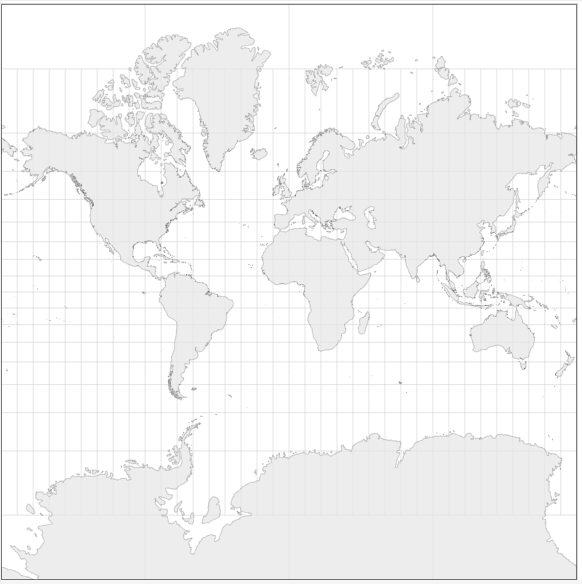
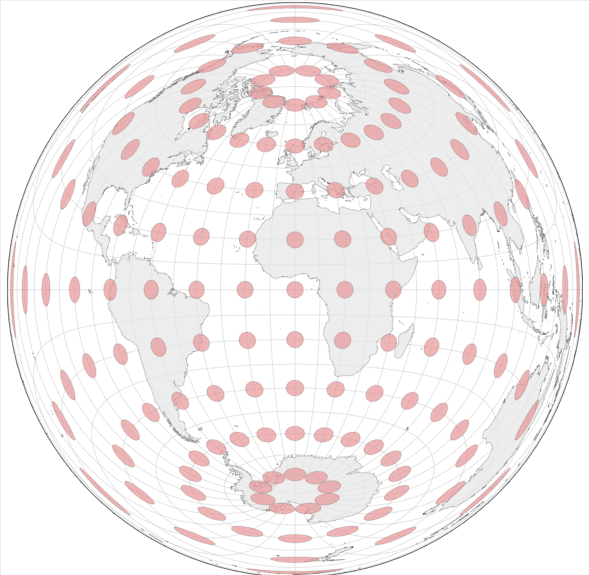
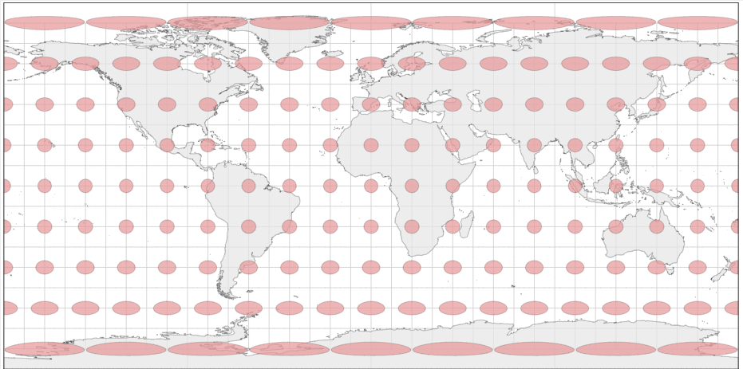
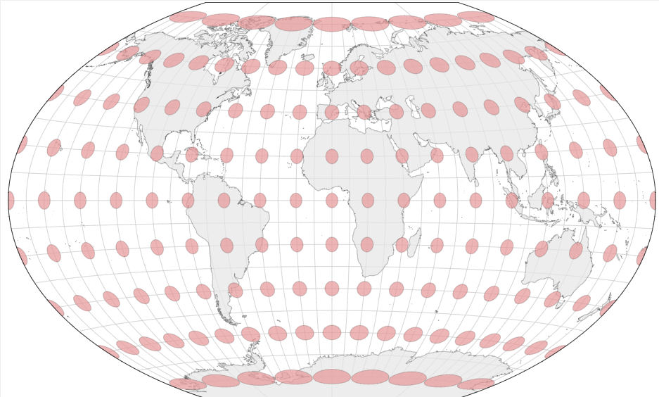

```{r, eval = knitr::is_html_output(), child="child/refs.md"}
```

# (APPENDIX) Anexo {.unnumbered}

# Tipos de CRS proyectados {#crsproy}

Existen varias familias de proyecciones, que se pueden clasificar de diversas
maneras: por tipo de superficie de proyección y por métrica a preservar.

## Por tipo de superficie de proyección

El proceso de trasladar puntos de una esfera a un plano puede plantearse de
manera práctica como el ejercicio de envolver una esfera con una superficie
plana (como una hoja de papel) y trasladar los puntos de la esfera de manera
lineal al punto de la superficie plana más cercano a ella. La Fig.
\@ref(fig:fi-proys) muestra estos tres tipos de proyección.

```{r fi-proys, echo=FALSE, fig.cap="Tipos de proyección por superficie de proyección"}

knitr::include_graphics("img/tipos_proy.png")
```

A partir de este ejercicio, se plantean tres posibles soluciones (cilíndrica,
cónica y acimutal o planar), dependiendo del tipo de superficie que se use para
proyectar.

-   **Proyecciones cilíndricas**: Son aquellas proyecciones donde la superficie
    de proyección conforma un cilindro alrededor de la Tierra. Una de las
    proyecciones cilíndricas más conocidas es la **proyección de Mercator** (Ver
    Fig. \@ref(fig:mercator)).

```{r mercator, echo=FALSE, out.width="40%", fig.cap="Proyección Mercator"}


```

-   **Proyecciones cónicas**: En este tipo de proyecciones, se plantea la
    superficie de proyección como una forma cónica. Como ejemplo, la
    **proyección cónica equiáreas de Albers** es una de las proyecciones que más
    suele usarse en la representación de mapas de América del Norte (Ver Fig.
    \@ref(fig:albers)).

```{r albers, echo=FALSE, out.width="40%", fig.cap="Proyección cónica equiáreas de Albers"}

knitr::include_graphics("img/albers_conic.png")
```

-   **Proyecciones acimutales o planares:** En este tipo de proyección se
    proyecta una porción de la Tierra sobre un plano que es tangente a la misma
    en el punto de referencia. Como ejemplos de proyecciones acimutales podemos
    destacar la **proyección ortográfica** (Ver Fig. \@ref(fig:orto)).

```{r orto, echo=FALSE, out.width="40%", fig.cap="Proyección ortogonal"}

knitr::include_graphics("img/orto.png")
```

## Por métrica a preservar

Es importante tener en cuenta que cualquier proyección de la superficie de la
Tierra produce distorsiones en una o varias características geográficas. Como
ejemplo clásico, la proyección de Mercator produce distorsiones del **tamaño**
especialmente en aquellas regiones más cercanas a los polos (Groenlandia, que la
proyección de Mercator presenta un área similar a la de África, tiene menor
superficie real que Argelia). Otras de las métricas que suele verse
distorsionada son la **distancia** entre dos puntos geográficos, la
**dirección** o la **forma** de regiones de la Tierra.

A lo largo de la Historia se han desarrollado diversas proyecciones cuyo
objetivo es preservar alguna o varias de las propiedades mencionadas
anteriormente, sin embargo, es importante destacar que **no existe una
proyección que sea capaz de preservar todas las métricas a la vez**.

Según la métrica a preservar, las proyecciones se pueden clasificar en:

-   **Proyecciones conformales:** Intentan preservar los **ángulos** que se
    forman en la superficie terrestre. Por ejemplo, la proyección de Mercator
    representa ángulos rectos en las intersecciones de los paralelos y los
    meridianos (Ver Fig. \@ref(fig:conform)).

```{r conform, echo=FALSE, out.width="30%", fig.cap="Ejemplo de proyección conformal: Mercator"}

knitr::include_graphics("img/conform.png")
```

-   **Proyecciones equivalentes**: Preservan las proporciones de las **áreas**,
    provocando a su vez deformaciones en el resto de características, como la
    forma o los ángulos. La proyección acimutal equivalente de Lambers es un
    tipo de proyección equivalente (Ver Fig. \@ref(fig:equiv)).

```{r equiv, echo=FALSE, out.width="30%", fig.cap="Ejemplo de proyección equivalente: Proyección acimutal equivalente de Lambers"}


```

-   **Proyecciones equidistantes:** Preservan la **distancia** entre dos puntos
    geográficos específicos. Por ejemplo, la proyección Plate carré preserva la
    distancia entre el Polo Norte y el Polo Sur (Ver Fig. \@ref(fig:equidist)).

```{r equidist, echo=FALSE, out.width="30%", fig.cap="Ejemplo de proyección equidistante: Platé carre"}


```

-   **Proyecciones de compromiso**: No intentan preservar ninguna métrica en
    concreto. En su lugar, se centran en intentar encontrar un **equilibrio**
    entre las diversas distorsiones que provocan para intentar dar una
    representación más o menos representativa de la superficie terrestre. La
    proyección de Winkel Tripel, usada en los mapas de National Geographic, es
    un ejemplo de proyección de compromiso (Ver Fig. \@ref(fig:comp)).

```{r comp, echo=FALSE, out.width="30%", fig.cap="Ejemplo de proyección de compromiso: Winkel Tripel"}


```

En los ejemplos anteriores se ha añadido a cada proyección la **indicatriz de
Tissot**. Ésta consiste en una serie de círculos imaginarios de igual área
distribuidos sobre la superficie esférica de la Tierra en determinados puntos.
De esta manera, al presentar la indicatriz de Tissot en una proyección
específica, se puede entender de una manera intuitiva la distorsión provocada
por dicha proyección, ya que los círculos se ven distorsionados o preservados
según los parámetros y la naturaleza de la proyección en cuestión.
