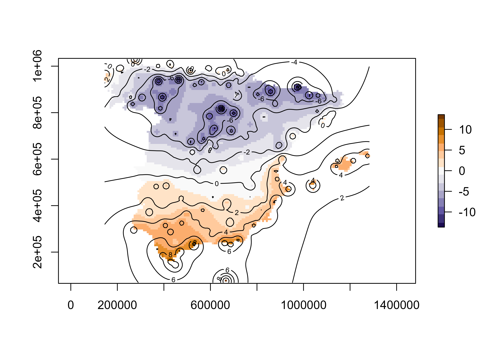
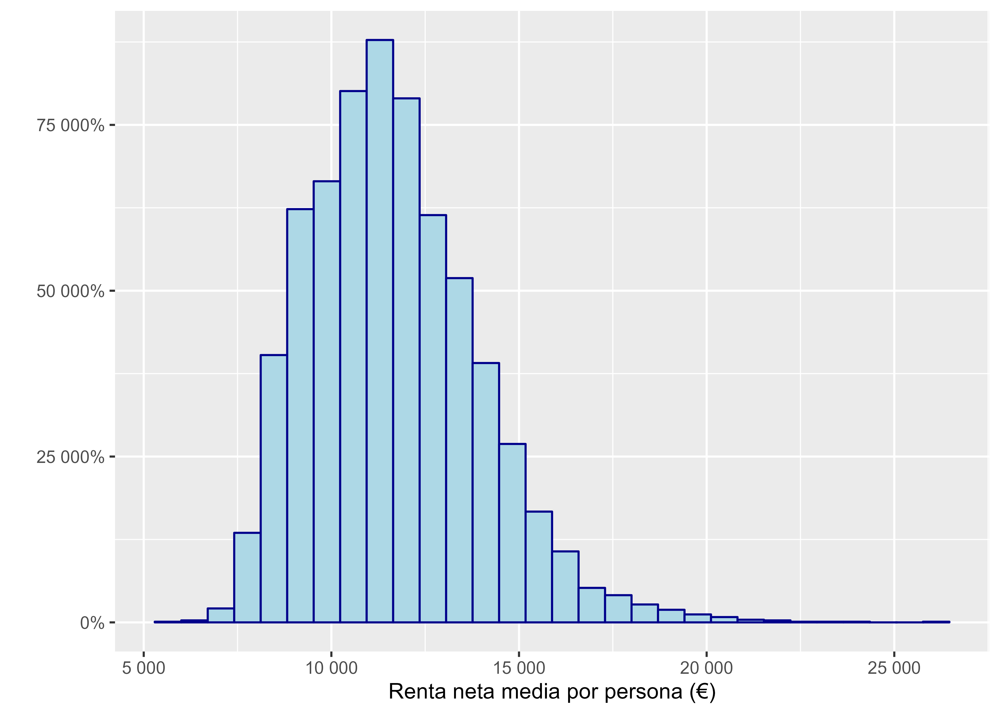
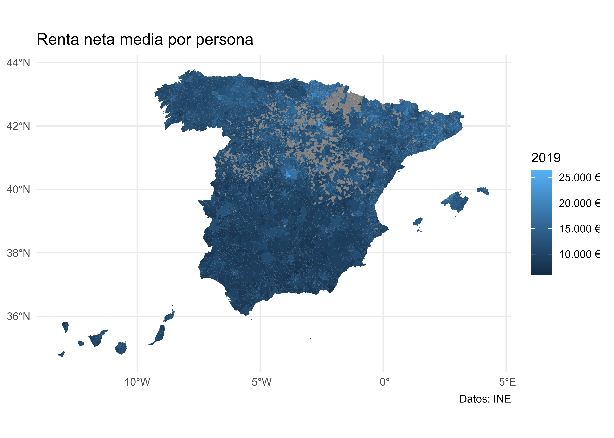
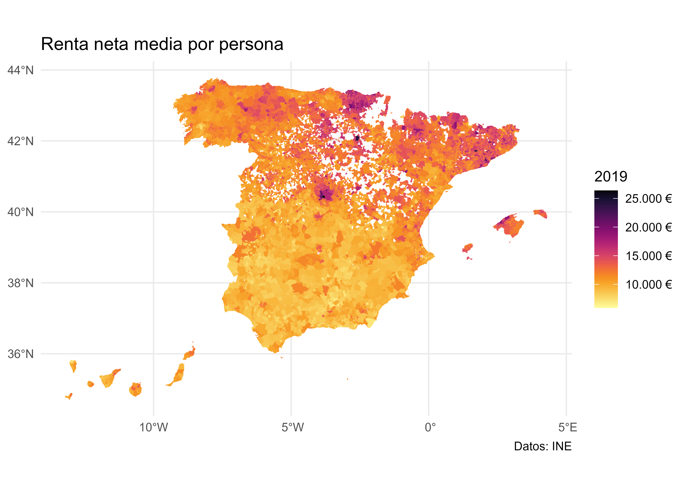
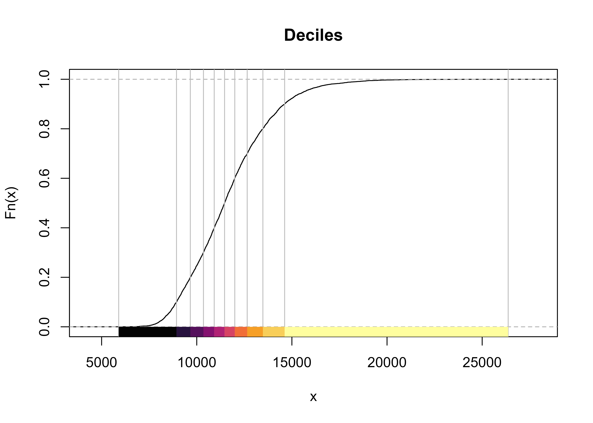
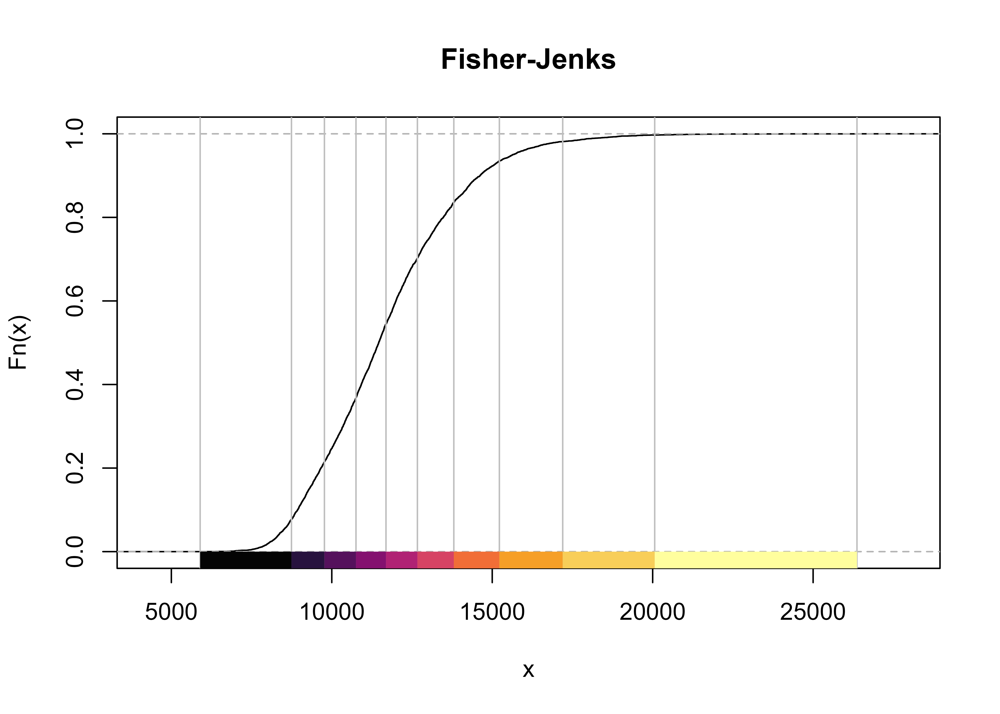
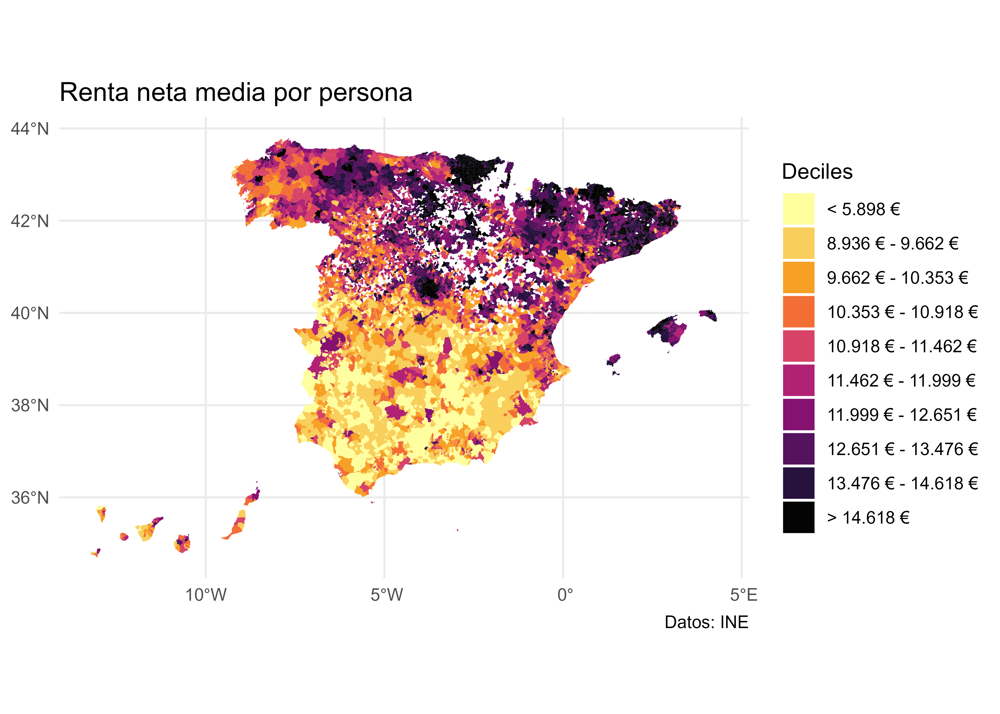
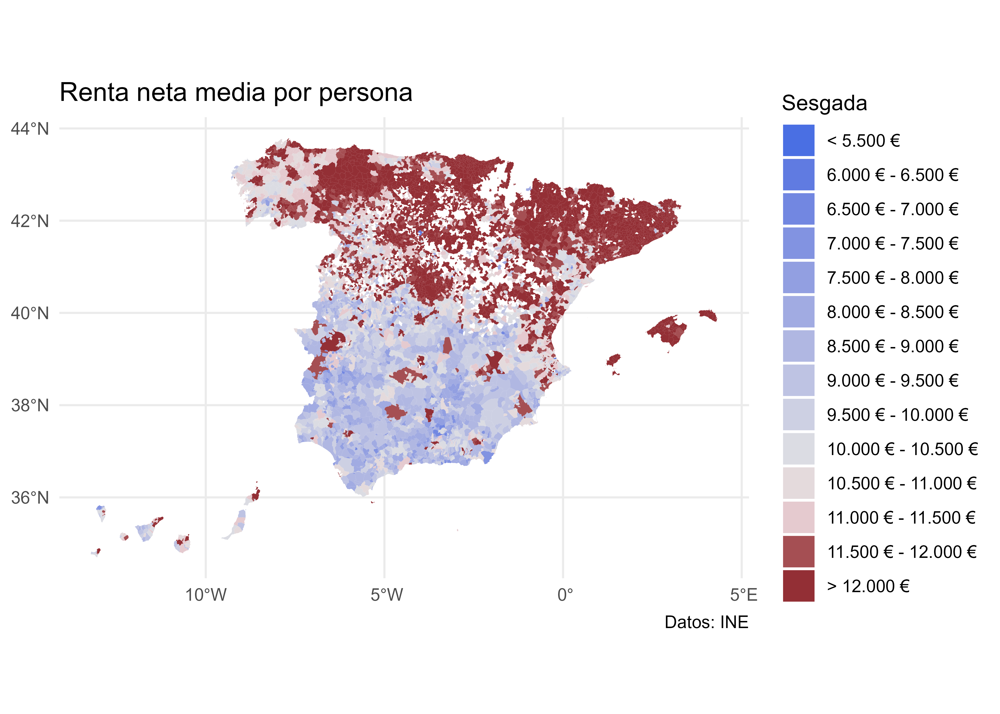
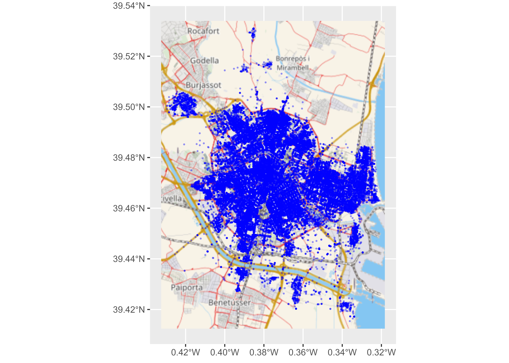
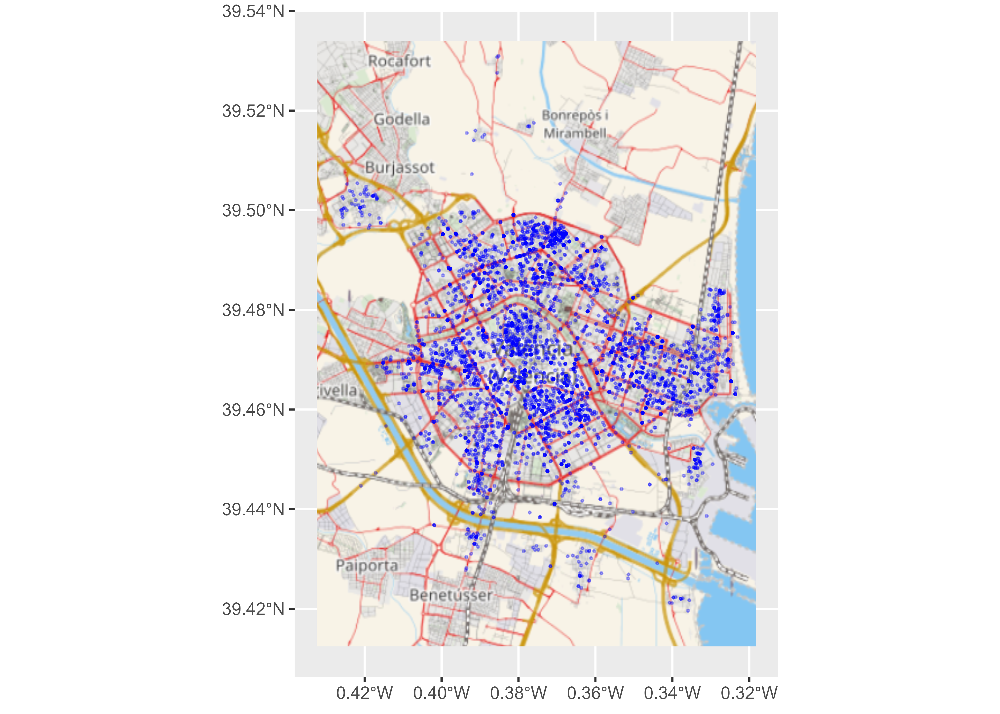

# Aplicaciones

***NOTA**: En las siguientes aplicaciones se asumen que los datos se localizan
en la carpeta `data` del proyecto de R-Studio en el que se esté trabajando.*

## Temperaturas mínimas en España

**Objetivo de aprendizaje**

Este caso práctico muestra como leer y graficar datos espaciales en R. Para
ello, vamos a trabajar con los datos de temperatura mínima registradas en España
por las estaciones metereológicas de la AEMET.

*Tarea 1: Abrimos RStudio*

El presente análisis se va a realizar empleando RStudio, por lo que empezaremos
abriendo el programa y creando un nuevo proyecto de R en *File>New Proyect*.

*Tarea 2: Importamos y describimos los datos objeto de estudio*

El conjunto de datos proporcionado `(tempmin.csv`) contiene el nivel de
temperatura del aire en España entre el 6 y el 10 de Enero de
2021[^aplicaciones-1]. Estos datos han sido descargados usando la librería
`climaemet` [@R-climaemet] y han sido posteriormente tratados para su uso en
esta práctica.

[^aplicaciones-1]: Las fechas seleccionadas coinciden con el periodo en el que
    la tormenta Filomena tuvo su auge en la Península Ibérica.

El primer paso consiste en importar la base de datos de temperatura mínima. El
archivo está en formato csv, por lo cual es un fichero de texto plano. Podemos
usar varias funciones para realizar la importación, en este caso vamos a emplear
paquetes del `tidyverse` para realizar todo el tratamiento de datos:


```r

library(readr)

# cada uno debe seleccionar el directorio donde tiene los datos, de ahí
# que sea conveniente trabajar con proyectos
tmin <- read_csv("data/tempmin.csv")
```

**Q1: ¿Qué información tiene `tmin`?**


Table: (\#tab:tmin-head)Detalle del objeto tmin

|fecha      |indicativo | tmin|  longitud|  latitud|
|:----------|:----------|----:|---------:|--------:|
|2021-01-06 |4358X      | -4.7| -5.880556| 38.95556|
|2021-01-06 |4220X      | -7.0| -4.616389| 39.08861|
|2021-01-06 |6106X      |  4.7| -4.748333| 37.02944|
|2021-01-06 |9698U      | -6.8|  0.865278| 42.20528|
|2021-01-06 |4410X      | -3.4| -6.385556| 38.91583|
|2021-01-06 |1331A      |  1.0| -7.031389| 43.52472|

Podemos observar que la tabla generada contiene 5 columnas distintas:

-   `fecha`: Indicando la fecha de observación.

-   `indicativo`: Es el identificador de la estación de la AEMET que registró el
    dato.

-   `tmin`: Dato de temperatura mínima registrada en cada fecha por la estación
    correspondiente en grados centígrados.

-   `longitud,latitud`: Coordenadas geográficas de la estación

*Tarea 3. Convertir* `tmin` *a un objeto de la clase espacial* `geoR`

Para convertir un objeto a geodata (el formato requerido por `geoR`),
proporcionaremos una tabla con las coordenadas y los valores a incluir en cada
coordenada. En este ejemplo, vamos a emplear sólamente los datos
correspondientes al **8 de enero.**


```r
library(dplyr)
library(geoR)
#> 'RandomFields' will use OMP

tmin_geoR <- tmin %>%
  filter(fecha == "2021-01-08") %>%
  # Seleccionamos las columnas de interés
  dplyr::select(longitud, latitud, tmin) %>%
  # Y creamos el objeto geodata
  as.geodata(
    coords.col = 1:2,
    data.col = 3
  )


summary(tmin_geoR)
#> Number of data points: 211 
#> 
#> Coordinates summary
#>      longitud  latitud
#> min -9.291389 35.27639
#> max  4.215556 43.78611
#> 
#> Distance summary
#>         min         max 
#>  0.01024389 13.85144264 
#> 
#> Data summary
#>        Min.     1st Qu.      Median        Mean     3rd Qu.        Max. 
#> -14.9000000  -4.6000000  -0.5000000  -0.6293839   3.5000000  13.6000000
plot(tmin_geoR)
```

<div class="figure" style="text-align: center">

<p class="caption">(\#fig:unnamed-chunk-2)Objetos en geoR</p>
</div>

*Tarea 4. Convertir* `tmin` *a un objeto de la clase espacial* `sf`

En esta tarea, convertiremos los datos de tmin en un objeto espacial `sf`, es
decir, datos espaciales de tipo vector.

Los datos de `tmin` contienen coordenadas geográficas longitud/latitud, asi que
como vimos en la sección **Sistema de Referencia de Coordenadas (CRS)** el CRS a
emplear ha de ser un CRS geográfico. Usaremos el código EPSG **4326**, que
corresponde a coordenadas geográficas y suele ser el habitual en este tipo de
situaciones.


```r
library(sf)

tmin_sf <- st_as_sf(tmin,
  coords = c("longitud", "latitud"),
  crs = 4326
)

tmin_sf
#> Simple feature collection with 1066 features and 3 fields
#> Geometry type: POINT
#> Dimension:     XY
#> Bounding box:  xmin: -9.291389 ymin: 35.27639 xmax: 4.215556 ymax: 43.78611
#> Geodetic CRS:  WGS 84
#> # A tibble: 1,066 x 4
#>    fecha      indicativo  tmin             geometry
#>  * <date>     <chr>      <dbl>          <POINT [°]>
#>  1 2021-01-06 4358X       -4.7 (-5.880556 38.95556)
#>  2 2021-01-06 4220X       -7   (-4.616389 39.08861)
#>  3 2021-01-06 6106X        4.7 (-4.748333 37.02944)
#>  4 2021-01-06 9698U       -6.8  (0.865278 42.20528)
#>  5 2021-01-06 4410X       -3.4 (-6.385556 38.91583)
#>  6 2021-01-06 1331A        1   (-7.031389 43.52472)
#>  7 2021-01-06 1690A       -0.1 (-7.859722 42.32528)
#>  8 2021-01-06 8489X       -8   (-0.255833 40.43333)
#>  9 2021-01-06 8025         2    (-0.494167 38.3725)
#> 10 2021-01-06 9784P      -10       (0.224722 42.63)
#> # ... with 1,056 more rows
```

*Tarea 5: Dibujemos las estaciones de monitoreo de la temperaria mínima en un
mapa de España. Ámbito espacial.*

Vamos, además, a incluir una capa de las comunidades autónomas de España. Para
ello usaremos un paquete API que nos proporciona esta información en formato
`sf`:


```r
library(mapSpain)
# sf object
esp <- esp_get_ccaa() %>%
  # No vamos a usar Canarias en este análisis
  filter(ine.ccaa.name != "Canarias")


plot(esp$geometry) # Dibujamo el mapa de España menos las Islas Canarias
```

<div class="figure" style="text-align: center">

<p class="caption">(\#fig:unnamed-chunk-4)Mapa de España (Sin Canarias)</p>
</div>

**Q2: ¿Tengo el Sistema de referencia de coordenadas (CRS) de las estaciones de
monitoreo en la misma proyección que el contorno de España?**

Como se comentó en la sección **Sistema de Referencia de Coordenadas (CRS)**,
cuando se emplean datos geográficos provenientes de varias fuentes, es necesario
asegurarse de que ambos objetos están usando el mismo CRS. Vamos a comprobarlo:


```r
st_crs(tmin_sf) == st_crs(esp)
#> [1] FALSE
```

Vemos que no lo están, por lo que vamos a proyectar las coordenadas a un CRS
común. En este caso usaremos el CRS de referencia de `tmin_sf`:


```r
esp2 <- st_transform(esp, st_crs(tmin_sf))

st_crs(tmin_sf) == st_crs(esp2)
#> [1] TRUE
```

Dibujamos las estaciones de monitoreo con el contorno de España. Vamos a usar el
paquete `ggplot2` como referencia, sin embargo existen varios paquetes
especializados en mapas temáticos, como pueden ser `tmap` o `mapsf`.


```r
library(ggplot2)

ggplot(esp2) +
  # Para graficar objetos sf debemos usar geom_sf()
  geom_sf() +
  geom_sf(data = tmin_sf) +
  theme_light() +
  labs(
    title = "Estaciones de monitoreo AEMET en  España",
    subtitle = "excluyendo las Islas Canarias"
  ) +
  theme(
    plot.title = element_text(
      size = 12,
      face = "bold"
    ),
    plot.subtitle = element_text(
      size = 8,
      face = "italic"
    )
  )
```

<div class="figure" style="text-align: center">

<p class="caption">(\#fig:unnamed-chunk-6)Estaciones de AEMET en la Península Ibérica</p>
</div>

*Tarea 6: Representamos la variable temperatura mínima `tmin` para el día 8 de
enero de 2021.*

En la siguiente tarea, seleccionaremos los datos correspondientes al **8 de
enero de 2021** y crearemos un mapa temático en el que representaremos los
valores de temperatura mínima registrados en cada estación mediante un código de
colores.


```r
tmin_8enero <- tmin_sf %>%
  # seleccionamos el día y la variable
  filter(fecha == "2021-01-08")


plot(tmin_8enero["tmin"],
  main = "Temperatura mínima (8-enero-2021)",
  pch = 8
)
```

<div class="figure" style="text-align: center">

<p class="caption">(\#fig:plot-base-tmin)Mapa de puntos con temperatura mínima</p>
</div>

Podemos utilizar el ámbito espacial, el contorno de España para graficar y
contar la historia de la Filomena un poco mejor.

<div class="figure" style="text-align: center">

<p class="caption">(\#fig:spatial-plots)Mapa completo con temperatura mínima</p>
</div>

*Tarea 7: Interpolación de la variable temperatura mínima `tmin` para el día 8
de enero de 2021 con IDW*

**Q3**: El mapa (\@ref(fig:spatial-plots)) ha quedado muy claro. Vemos como los
datos nos cuentan la historia de Filomena en aquellos sitios donde se tomaron
mediciones, pero **¿podríamos tener un mapa de interpolación para tener una
estimación de la temperatura mínima en las partes donde la AEMET no tiene
estación de monitoreo?**

Tal y como se avanzó en teoría, parece lógico pensar que aquellos puntos que
estén cerca tendrán valores similares así que tomemos ventaja de la dependencia
espacial y utilicemos un método determinista, como la Distancia Inversa
Ponderada, comúnmente conocido por su acrónimo inglés IDW (Inverse distance
weighted), el cual es uno de los métodos más simples para llevar para llevar a
cabo una interpolación espacial.

En este tipo de análisis, es crucial que el CRS sea el apropiado. En este caso,
ya definimos el CRS como un CRS geográfico (es decir, usando coordenadas de
longitud y latitud). Sin embargo, para el ejercicio de interpolación es más
adecuado usar un CRS local (que provoque pocas deformaciones en la proyección de
España) y en alguna unidad de distancia, como metros (ya vimos que en los CRS
geográficos las unidades son grados).

Si usamos el paquete `crsuggest` podemos observar los CRS sugeridos:


```r
library(crsuggest)

sugiere <- suggest_crs(tmin_8enero, units = "m", limit = 5)

# Usamos la sugerencia del paquete
crs_sugerido <- st_crs(sugiere[1, ]$crs_proj4)

esp3 <- st_transform(esp2, crs_sugerido)
tmin_8enero3 <- st_transform(tmin_8enero, crs_sugerido)
```

**Q4: ¿Dónde vamos a interpolar? ¿En que puntos?**

Para realizar la interpolación, necesitamos generar una malla que representará
las celdas de las que queremos obtener el valor interpolado.

Dado que hemos proyectado nuestros datos a un CRS cuya unidad son los metros,
podemos definir el tamaño de cada celda en metros cuadrados. En este caso vamos
a usar celdas de 100 kms cuadrados (10 x 10 kms):


```r
set.seed(9876) # Con esto aseguramos que el grid generado siempre es igual

malla_sf <- st_make_grid(
  esp3,
  cellsize = 8000
)
```

Graficamos la superficie para ver exactamente qué hemos construido:


```r

ggplot(esp3) +
  geom_sf() +
  geom_sf(
    data = malla_sf,
    size = 0.1,
    col = "red", alpha = 1,
    fill = NA
  ) +
  geom_sf(
    data = tmin_8enero3,
    aes(fill = "AEMET Stations"), size = 4, shape = 21,
    color = "blue"
  ) +
  scale_fill_manual(values = adjustcolor("blue", alpha.f = 0.2)) +
  theme_void() +
  theme(legend.position = "bottom") +
  labs(
    title = "Cuadrícula espacial para interpolar",
    fill = ""
  )
```

<div class="figure" style="text-align: center">

<p class="caption">(\#fig:malla)Malla de puntos para interpolación</p>
</div>

En la Fig. \@ref(fig:malla) se puede observar claramente cada una de las celdas
que hemos creado. La interpolación asignará un valor a cada uno de ellas.

A continuación podemos llevar a cabo la interpolación usando el paquete `gstat`.
Además, en lugar de celdas (polígonos) es necesario usar puntos en la
interpolación. Calcularemos, por tanto, un punto representativo de cada celda,
el centroide, que es el punto resultante de realizar la media arimética de las
coordenadas de loss puntos que componen los lados de cada celda


```r
# Calculamos centroide
malla_sf_cent <- st_centroid(malla_sf, of_largest_polygon = TRUE)

library(gstat)
tmin_idw <- idw(
  # Indicamos la variable que queremos interpolar
  tmin ~ 1,
  # Indicamos el conjunto de datos donde está la variable
  tmin_8enero3,
  # Indicamos la malla de destino, en sf
  newdata = malla_sf_cent,
  idp = 2.0 # Especifica la potencia de la IDW
)
#> [inverse distance weighted interpolation]
head(tmin_idw)
#> Simple feature collection with 6 features and 2 fields
#> Geometry type: POINT
#> Dimension:     XY
#> Bounding box:  xmin: 146290.9 ymin: 69457.31 xmax: 186290.9 ymax: 69457.31
#> CRS:           +proj=lcc +lat_1=40 +lat_0=40 +lon_0=0 +k_0=0.9988085293 +x_0=600000 +y_0=600000 +a=6378298.3 +rf=294.73 +pm=madrid +units=m +no_defs
#>   var1.pred var1.var                  geometry
#> 1  2.518621       NA POINT (146290.9 69457.31)
#> 2  2.586930       NA POINT (154290.9 69457.31)
#> 3  2.656846       NA POINT (162290.9 69457.31)
#> 4  2.728395       NA POINT (170290.9 69457.31)
#> 5  2.801600       NA POINT (178290.9 69457.31)
#> 6  2.876486       NA POINT (186290.9 69457.31)
```

*Tarea 8. Mapa de contorno*

Representamos la interpolación con un mapa y mapa de contorno muy utilizado para
representar datos espaciales. Para ello, vamos a usar el paquete `raster`
convirtiendo nuestro objeto interpolado.


```r
# Convertimos de sf a SpatiaPixels
# Esto funciona porque nuestros puntos sf están espaciados regularmente

tmin_pixels <- tmin_idw %>%
  as("Spatial") %>%
  as("SpatialPixels")


library(raster)
# Creamos un raster de nuestros pixels
rast_esp <- raster(tmin_pixels)

# Transferimos valores del objeto sf al raster
rast_esp2 <- rasterize(
  tmin_idw,
  rast_esp,
  field = "var1.pred", ## valores de predicción
  fun = mean
)

# Además, podemos recortar el raster a la forma de España

rast_esp_mask <- mask(rast_esp2, esp3)

plot(rast_esp_mask, col = colores)
contour(rast_esp2, add = TRUE)
```

<div class="figure" style="text-align: center">

<p class="caption">(\#fig:unnamed-chunk-9)Mapa raster con lineas de nivel</p>
</div>

Podemos realizar el mismo mapa usando `ggplot2` y la función
`geom_contour_filled`:


```r

# Creo una tabla para geom contour
coordenadas <- st_coordinates(tmin_idw)
valor <- tmin_idw$var1.pred

idw_df <- data.frame(
  # Necesitamos redondear las coordenadas
  latitud = round(coordenadas[, 2], 6),
  longitud = round(coordenadas[, 1], 6),
  tmin = valor
)

ggplot() +
  geom_contour_filled(
    data = idw_df,
    aes(x = longitud, y = latitud, z = tmin),
    na.rm = TRUE,
    breaks = cortes
  ) +
  # Reajustamos la escala de colores
  scale_fill_manual(values = colores) +
  # CCAA
  geom_sf(data = esp3, fill = NA) +
  theme_minimal() +
  theme(axis.title = element_blank()) +
  labs(
    fill = "Temp. (º)",
    title = "Temperatura mínima interpolada",
    subtitle = "8 de Enero 2021",
    caption = "Datos: AEMET"
  )
```

<div class="figure" style="text-align: center">

<p class="caption">(\#fig:unnamed-chunk-10)Mapa con ggplot2 y lineas de nivel</p>
</div>

## Renta media por municipios

Esta sección presenta un caso de uso en el que aprenderemos a realizar las
siguientes tareas básicas:

-   Importar datos tabulares y datos espaciales.

-   Realizar un tratamiento de limpieza de datos y cruzar tablas.

-   Hacer mapas temáticos. Aprenderemos también algunas nociones básicas sobre
    cómo crear diferentes clases para un conjunto de datos continuo.

Para ello, partiremos de dos ficheros:

1.  Fichero `renta_municipio.csv`: Este fichero contiene información de la Renta
    Neta per cápita por municipios (en euros), distritos y secciones censales.
    Esta información se ha extraído del [Atlas de distribución de renta de los
    hogares](https://www.ine.es/experimental/atlas/experimental_atlas.htm)
    proporcionado por el INE, y ha sido tratado previamente para adaptar la
    información al presente ejercicio.

2.  Fichero `municipios.gpkg`: Es un fichero que contiene datos espaciales
    (polígonos) de los municipios en España en el año 2019. Se ha extraído del
    Instituto Geográfico Nacional (IGN) usando el paquete `mapSpain`.

*Tarea 1. Importar los datos a R*

El primer paso en cualquier tipo de análisis de datos es importar los datos al
software de tratamiento (en nuestro caso, R) y analizarlos para conocer el tipo
de información que contiene:


```r
# Usaremos paquetes del tidyverse
library(dplyr)
library(readr)

renta <- read_csv("data/renta_municipio.csv", na = ".")
```


```r
library(sf)
munis <- st_read("data/municipios.gpkg", quiet = TRUE)
```

**Q1: ¿Qué información tenemos sobre la variable?**


```r
head(renta)
#> # A tibble: 6 x 6
#>   Unidad                          `2019` `2018` `2017` `2016` `2015`
#>   <chr>                            <dbl>  <dbl>  <dbl>  <dbl>  <dbl>
#> 1 44001 Ababuj                        NA     NA     NA     NA     NA
#> 2 4400101 Ababuj distrito 01          NA     NA     NA     NA     NA
#> 3 4400101001 Ababuj sección 01001     NA     NA     NA     NA     NA
#> 4 40001 Abades                     11429  10731  10314   9816   9904
#> 5 4000101 Abades distrito 01       11429  10731  10314   9816   9904
#> 6 4000101001 Abades sección 01001  11429  10731  10314   9816   9904
```

Podemos comprobar que tenemos información para los años 2015 a 2019. Además, la
columna `Unidad` contiene un literal con el municipio o sección correspondiente.

**Q2: ¿Qué información tenemos sobre el objeto espacial?**


```r
head(munis)
#> Simple feature collection with 6 features and 7 fields
#> Geometry type: MULTIPOLYGON
#> Dimension:     XY
#> Bounding box:  xmin: -3.140179 ymin: 36.73817 xmax: -2.057058 ymax: 37.54579
#> Geodetic CRS:  ETRS89
#>   codauto ine.ccaa.name cpro ine.prov.name cmun      name LAU_CODE                           geom
#> 1      01     Andalucía   04       Almería  001      Abla    04001 MULTIPOLYGON (((-2.775594 3...
#> 2      01     Andalucía   04       Almería  002  Abrucena    04002 MULTIPOLYGON (((-2.787566 3...
#> 3      01     Andalucía   04       Almería  003      Adra    04003 MULTIPOLYGON (((-3.051988 3...
#> 4      01     Andalucía   04       Almería  004 Albanchez    04004 MULTIPOLYGON (((-2.181086 3...
#> 5      01     Andalucía   04       Almería  005 Alboloduy    04005 MULTIPOLYGON (((-2.572442 3...
#> 6      01     Andalucía   04       Almería  006     Albox    04006 MULTIPOLYGON (((-2.128106 3...
```

Podemos comprobar que `munis` es un objeto que contiene Polígonos y varias
columnas, entre ellas dos especialmente relevantes: `cpro` y `cmun`, que
corresponden a los códigos de provincia y de municipio respectivamente. Podemos
comprobar que este código también se encuentra en nuestro dataset `renta`.

*Tarea 2. Comprobamos campos en común para un municipio: Noblejas*


```r
# Miro un municipio: Noblejas

renta[grep("Noblejas", renta$Unidad), ]
#> # A tibble: 5 x 6
#>   Unidad                            `2019` `2018` `2017` `2016` `2015`
#>   <chr>                              <dbl>  <dbl>  <dbl>  <dbl>  <dbl>
#> 1 45115 Noblejas                     10591  10314   9751   9484   9124
#> 2 4511501 Noblejas distrito 01       11039  10717  10135   9711   9386
#> 3 4511501001 Noblejas sección 01001  11039  10717  10135   9711   9386
#> 4 4511502 Noblejas distrito 02       10276  10029   9475   9319   8938
#> 5 4511502001 Noblejas sección 02001  10276  10029   9475   9319   8938

munis[grep("Noblejas", munis$name), c("name", "cpro", "cmun")]
#> Simple feature collection with 1 feature and 3 fields
#> Geometry type: MULTIPOLYGON
#> Dimension:     XY
#> Bounding box:  xmin: -3.489824 ymin: 39.93003 xmax: -3.372611 ymax: 40.05017
#> Geodetic CRS:  ETRS89
#>          name cpro cmun                           geom
#> 4985 Noblejas   45  115 MULTIPOLYGON (((-3.44681 40...
```

En el caso de Noblejas, el código completo es **45115**. Sin embargo, en el caso
de la tabla `renta`, debemos extraer ese valor del literal, ya que no tenemos
este valor directamente, sino en combinación con otros valores ("**45115
Noblejas**"). Para conseguir extraer un campo adecuado para el cruce en la tabla
`renta` que contenga únicamente el código numérico vamos a hacer la siguiente
manipulacion de datos:

-   Para cada valor de la columna `Unidad`, dividiremos el texto usando los
    espacios como delimitadores ("**45115 Noblejas"** pasará a ser **c("45115",
    "Noblejas")**) y extraremos el código como el primer valor del vector
    (**c("45115", "Noblejas")\[1\]** extrae **"45115"**).

-   Usaremos ese resultado para crear una nueva columna `codigo_ine` que
    usaremos como campo para cruzar.


```r

# Creo una función y la aplico a toda la columna
extrae_codigo <- function(x) {
  unlist(strsplit(x, " "))[1]
}

renta$codigo_ine <- sapply(as.character(renta$Unidad), extrae_codigo)

head(renta[c("Unidad", "codigo_ine")])
#> # A tibble: 6 x 2
#>   Unidad                          codigo_ine
#>   <chr>                           <chr>     
#> 1 44001 Ababuj                    44001     
#> 2 4400101 Ababuj distrito 01      4400101   
#> 3 4400101001 Ababuj sección 01001 4400101001
#> 4 40001 Abades                    40001     
#> 5 4000101 Abades distrito 01      4000101   
#> 6 4000101001 Abades sección 01001 4000101001
```

Ahora, es necesario crear la misma variable en `munis` para poder realizar el
cruce:


```r

munis$codigo_ine <- paste0(munis$cpro, munis$cmun)

head(munis[, c("name", "codigo_ine")])
#> Simple feature collection with 6 features and 2 fields
#> Geometry type: MULTIPOLYGON
#> Dimension:     XY
#> Bounding box:  xmin: -3.140179 ymin: 36.73817 xmax: -2.057058 ymax: 37.54579
#> Geodetic CRS:  ETRS89
#>        name codigo_ine                           geom
#> 1      Abla      04001 MULTIPOLYGON (((-2.775594 3...
#> 2  Abrucena      04002 MULTIPOLYGON (((-2.787566 3...
#> 3      Adra      04003 MULTIPOLYGON (((-3.051988 3...
#> 4 Albanchez      04004 MULTIPOLYGON (((-2.181086 3...
#> 5 Alboloduy      04005 MULTIPOLYGON (((-2.572442 3...
#> 6     Albox      04006 MULTIPOLYGON (((-2.128106 3...
```

*Tarea 3: Unimos los objetos renta y mapas con la función `left_join`*

Ya estamos listos para realizar el cruce. Además, seleccionaremos sólo las
columnas que vamos a usar, en este caso la del año 2019:


```r

munis_renta <- munis %>%
  left_join(renta) %>%
  dplyr::select(name, cpro, cmun, `2019`)
```

**Cuando crucemos datos espaciales con datos no espaciales en R, es importante
que el primer dataset sea el que contiene los datos espaciales**. Esto es así
porque el objeto resultante "hereda" la clase del primer objeto.

**Q3: ¿Qué ocurre si realizáramos el proceso poniendo los datos espaciales en el
lado derecho del join?**

A modo de ejemplo, si realizáramos el proceso poniendo los datos espaciales en
el lado derecho del join, los datos finales no serán espaciales:


```r

# Miramos la clase de munis_renta

class(munis_renta)
#> [1] "sf"         "data.frame"

# Es un sf, por tanto espacial

# ¿Que pasa si realizamos el cruce de la otra manera?
renta %>%
  left_join(munis) %>%
  dplyr::select(name, cpro, cmun, `2019`) %>%
  class()
#> [1] "tbl_df"     "tbl"        "data.frame"
```

El resultado es un tibble o data.frame, **¡pero no es espacial!**

*Tarea 4. Histograma de la distribución de la renta*

Una vez que tenemos los datos unidos podemos realizar algunos análisis básicos,
como la realización de un histograma


```r

library(ggplot2)

munis_renta %>%
  ggplot(aes(x = `2019`)) +
  geom_histogram(color = "darkblue", fill = "lightblue") +
  scale_x_continuous(labels = scales::label_number_auto()) +
  scale_y_continuous(labels = scales::label_percent()) +
  labs(
    y = "",
    x = "Renta neta media por persona (€)"
  )
```

<div class="figure" style="text-align: center">

<p class="caption">(\#fig:basic)Histograma de la Renta per cápita en España (2019)</p>
</div>

En la Fig. \@ref(fig:basic) podemos observar que la renta presenta una
distribución Gamma con un gran de municipios concentrados en zonas medias de
renta y pocos municipios en tramos de rentas altas. Como veremos más adelante,
esta distribución va a afectar a la información que transmite el mapa.

*Tarea 5. Mapa de coropletas de la distribución de la renta*

Vamos a realizar ahora un mapa de coropletas mostrando la distribución de la
renta usando los valores brutos de renta sin modificar:


```r

ggplot(munis_renta) +
  # Usamos geom_sf, y como aes() lo que queremos mostrar, en este caso, el
  # color del polígono representa la renta. Vamos a retirar los bordes con
  # color = NA
  geom_sf(aes(fill = `2019`), color = NA) +
  theme_minimal() +
  scale_fill_continuous(labels = scales::label_number(
    big.mark = ".",
    decimal.mark = ",",
    suffix = " €"
  )) +
  labs(
    title = "Renta neta media por persona",
    caption = "Datos: INE"
  )
```

<div class="figure" style="text-align: center">

<p class="caption">(\#fig:maparenta1)Renta neta media por persona</p>
</div>

Este primer mapa no es demasiado informativo, por los siguientes motivos:

-   Existe una serie de municipios para los que no tenemos datos.

-   La escala de color no es la más adecuada.

-   Dada la distribución de los datos, puede ser adecuado crear grupos de renta
    para que el mapa sea más interpretable.

*Tarea 6. Eliminamos los municipios sin datos y cambiamos la escala de color*

Vamos a probar a eliminar los municipios sin datos y a cambiar la escala de
color para ver si mejora la visualización.


```r

munis_renta_clean <- munis_renta %>% filter(!is.na(`2019`))

ggplot(munis_renta_clean) +
  geom_sf(aes(fill = `2019`), color = NA) +
  # Cambiamos la paleta de colores, vamos a usar una paleta denominada Inferno,
  # ya incluida en base R con hcl.colors

  # Como son datos continuos, puedo usar Inferno
  scale_fill_gradientn(
    colours = hcl.colors(20, "Inferno", rev = TRUE),
    labels = scales::label_number(
      big.mark = ".",
      decimal.mark = ",",
      suffix = " €"
    )
  ) +
  theme_minimal() +
  labs(
    title = "Renta neta media por persona",
    caption = "Datos: INE"
  )
```

<div class="figure" style="text-align: center">

<p class="caption">(\#fig:maparenta2)Renta neta media por persona con paleta de colores alternativa</p>
</div>

Este mapa nos da algo más de información, y parece intuirse que las rentas más
altas se encuentran en zonas de País Vasco, Madrid y Cataluña. Sin embargo, el
hecho de que la distribución de los datos no sea normal está afectando a la
visualización.

*Tarea 7. Agrupar los datos en clases para mejorar la visualización*

Para intentar atajar este problema, podemos dividir nuestros datos en clases,
por ejemplo cuartiles o deciles. Existen varios métodos de clasificación de
datos, que en R se encuentran implementados en el paquete `classInt`. A
continuación vamos a plantear diversos métodos de clasificación y observar cómo
la "historia" que cuenta el mapa varía en función de dichas clases. En este
ejemplo planteamos los siguientes métodos de clasificación:

-   El método de deciles: consiste en crear 10 categorías incluyendo el mismo
    número de registros en cada una de ellas.

-   El método de intervalos equivalentes: divide el rango de valores en un
    número de grupos definido. La distancia de todos los intervalos es idéntica,
    por lo que este método no tiene en cuenta la distribución de los registros.

-   El método de Fisher-Jenks: desarrollado específicamente para la
    clasificación de datos espaciales y su visualización en mapas. Produce
    agrupaciones de tal manera que los datos de cada grupo son "cercanas" entre
    sí y sustancialmente distintas de los valores de otros grupos.


```r

library(classInt)
# Vamos a probar 3 métodos de clasificación: Deciles, tramos de Renta
# equidistantes y Fisher and Jenks

deciles <- classIntervals(munis_renta_clean$`2019`,
  style = "quantile", n = 10
)
deciles
#> style: quantile
#>     [5898,8935.6)   [8935.6,9662.2)  [9662.2,10352.8)   [10352.8,10918)     [10918,11462) 
#>               656               656               655               654               655 
#>   [11462,11998.6) [11998.6,12651.4) [12651.4,13475.8) [13475.8,14618.4)   [14618.4,26367] 
#>               658               656               655               656               656
plot(deciles, pal = hcl.colors(20, "Inferno"), main = "Deciles")
```

<div class="figure" style="text-align: center">

<p class="caption">(\#fig:deciles)Deciles de renta</p>
</div>


```r

# Tramos equidistantes en términos de renta
equal <- classIntervals(munis_renta_clean$`2019`,
  style = "equal", n = 10
)
equal
#> style: equal
#>     [5898,7944.9)   [7944.9,9991.8)  [9991.8,12038.7) [12038.7,14085.6) [14085.6,16132.5) 
#>               103              1510              2374              1637               702 
#> [16132.5,18179.4) [18179.4,20226.3) [20226.3,22273.2) [22273.2,24320.1)   [24320.1,26367] 
#>               161                52                14                 3                 1
plot(equal, pal = hcl.colors(20, "Inferno"), main = "Equidistantes")
```

<div class="figure" style="text-align: center">

<p class="caption">(\#fig:equidist)Tramos de renta equidistante</p>
</div>


```r

fisher <- classIntervals(munis_renta_clean$`2019`,
  style = "fisher",
  # Fuerzo para mejorar la comparación entre métodos
  n = 10
)
fisher
#> style: fisher
#>       [5898,8743)     [8743,9770.5)    [9770.5,10754)     [10754,11689)     [11689,12668) 
#>               505               904              1005              1159              1032 
#>     [12668,13803)   [13803,15222.5) [15222.5,17196.5) [17196.5,20063.5)   [20063.5,26367] 
#>               874               651               305               103                19
plot(fisher,
  pal = hcl.colors(20, "Inferno"),
  main = "Fisher-Jenks"
)
```

<div class="figure" style="text-align: center">

<p class="caption">(\#fig:fisher)Tramos de renta usando Fisher-Jenks</p>
</div>

Podemos observar lo siguiente:

-   El último decil de renta se corresponde a un rango de entre 15.000 y 25.000
    € (Fig \@ref(fig:deciles)).

-   El método por deciles (Fig \@ref(fig:deciles)) proporciona unos grupos con
    valores de renta muy parecidos entre sí en los valores medios. Esto es
    debido a la propia distribución de la variable.

-   El método de rangos equidistantes (Fig \@ref(fig:equidist)) proporciona
    algunos grupos con un número muy reducido de municipios.

-   El método de Fisher-Jenks (Fig \@ref(fig:fisher)) puede proporcionar unas
    clases con unos rangos más apropiados para los tramos altos de renta.

*Tarea 8. Representar los mapas según las clases obtenidas*

Vamos ahora a realizar 3 mapas distintos, creando clases de renta según cada uno
de los métodos anteriormente mostrados.

**Deciles**


```r
# Extraigo los valores de corte
breaks_d <- deciles$brks

# Y creo unas etiquetas básicas para cada clase
# Creo una función específica para crear etiquetas formateadas
label_fun <- function(x) {
  l <- length(x)
  eur <- paste0(prettyNum(round(x, 0),
    decimal.mark = ",",
    big.mark = "."
  ), " €")

  labels <- paste(eur[-l], "-", eur[-1])
  labels[1] <- paste("<", eur[1])
  labels[l - 1] <- paste(">", eur[l - 1])
  return(labels)
}

labels_d <- label_fun(breaks_d)

munis_renta_clean$Deciles <- cut(munis_renta_clean$`2019`,
  breaks = breaks_d,
  labels = labels_d,
  include.lowest = TRUE
)

ggplot(munis_renta_clean) +
  # Cambiamos la variable que usamos para crear el mapa
  geom_sf(aes(fill = Deciles), color = NA) +
  # Necesito cambiar el scale, ya no es continua
  scale_fill_manual(values = hcl.colors(length(labels_d),
    "Inferno",
    rev = TRUE
  )) +
  theme_minimal() +
  labs(
    title = "Renta neta media por persona",
    caption = "Datos: INE"
  )
```

<div class="figure" style="text-align: center">

<p class="caption">(\#fig:mapa-deciles)Mapa por deciles de renta</p>
</div>

El mapa de la Fig. \@ref(fig:mapa-deciles) ya nos permite observar patrones
geográficos, donde se ve una clara diferencia entre la Comunidades Autónomas del
Norte y las del Sur. Veamos una representación distina usando otras clases
diferentes:


```r

breaks_e <- equal$brks
labels_e <- label_fun(breaks_e)

munis_renta_clean$Equal <- cut(munis_renta_clean$`2019`,
  breaks = breaks_e,
  labels = labels_e,
  include.lowest = TRUE
)

ggplot(munis_renta_clean) +
  # Cambiamos la variable que usamos para crear el mapa
  geom_sf(aes(fill = Equal), color = NA) +
  scale_fill_manual(values = hcl.colors(length(labels_e),
    "Inferno",
    rev = TRUE
  )) +
  theme_minimal() +
  labs(
    title = "Renta neta media por persona",
    caption = "Datos: INE"
  )
```

<div class="figure" style="text-align: center">

<p class="caption">(\#fig:mapa-equal)Mapa por tramos de renta equidistantes</p>
</div>

El mapa de la Fig. \@ref(fig:mapa-equal), sin embargo, se parece más al mapa que
hicimos con los datos sin clasificar (Fig. \@ref(fig:maparenta2)), donde el peso
visual se concentra más bien en los municipios con rentas mucho más altas que el
resto (por encimoa de 18.000 €).

Veamos el mismo mapa usando Fisher-Jenks:


```r

breaks_f <- fisher$brks
labels_f <- label_fun(breaks_f)

munis_renta_clean$`Fisher-Jenks` <- cut(munis_renta_clean$`2019`,
  breaks = breaks_f,
  labels = labels_f,
  include.lowest = TRUE
)

ggplot(munis_renta_clean) +
  # Cambiamos la variable que usamos para crear el mapa
  geom_sf(aes(fill = `Fisher-Jenks`), color = NA) +
  scale_fill_manual(values = hcl.colors(length(labels_f),
    "Inferno",
    rev = TRUE
  )) +
  theme_minimal() +
  labs(
    title = "Renta neta media por persona",
    caption = "Datos: INE"
  )
```

<div class="figure" style="text-align: center">

<p class="caption">(\#fig:mapa-fisher)Mapa por tramos según Fisher-Jenks</p>
</div>

En el mapa de la Fig. \@ref(fig:mapa-fisher) se puede observar de una manera más
clara un cluster adicional de renta en la zona de Asturias y el norte de León.
Además, gracias a la escala de colores puede intuirse que este clúster de renta
no presenta valores tan altos como los observados en País Vasco o Madrid.

En conclusión, en el momento de realizar una visualización de datos es
importante conocer el dato a representar, así como entender algunas propiedades
básicas de la distribución subyacente. También hemos podido observar que hay
ciertas decisiones estéticas (datos continuos vs. agrupados, escala de colores)
que tienen una influencia significativa en cómo se percibe la información
representada. Es responsabilidad del creador de la visualización el conocer
todos estos factores y aplicarlos de manera conveniente.

**Q4: Tenemos un mapa de los mismos datos pero la información se presenta de
manera sesgada, ¿puedes identificar los motivos?**

<div class="figure" style="text-align: center">

<p class="caption">(\#fig:trucado)Ejemplo de visualización sesgada</p>
</div>

En el mapa de la Fig. \@ref(fig:trucado) parece que la renta per cápita de las
comunidades del norte es desproporcionadamente superior a las del sur. Resumimos
aquí los sesgos introducidos en el mapa:

-   En primer lugar, se han creado un elevado número de grupos en las zonas de
    rentas bajas. De esta manera, la escala del mapa parece estar muy
    fragmentada, sin embargo muchos de esos grupos apenas contienen municipios.
    A modo de ejemplo, los primeros cuatro grupos únicamente contienen 32
    municipios.

-   Los grupos no se adaptan a la distribución subyacente de los datos. La
    mediana de los datos (11.462 €) estaría situada en la antepenúltima clase,
    de manera que los dos grupos de mayor renta contienen el 50% de los
    municipios.

-   Además, la escala de color se ha manipulado, de manera que los grupos de
    mayores renta destaquen más que el resto de manera notoria.

## Análisis de patrones de puntos

Las técnicas de análisis de patrones de puntos analizan la distribución de
eventos geolocalizados que surgen al azar. La diferencia fundamental con otros
análisis que comprenden también el uso de localizaciones (como las temperaturas
mínimas medidas por estaciones meteorológicas) es que en este caso los puntos
representan eventos conocidos y aleatorios (por ejemplo, los crímenes ocurridos
en una ciudad, accidentes de tráfico o incendios en una región). A diferencia de
otros eventos, como el ejemplo de las temperaturas mínimas, la ausencia de datos
no se debe a la ausencia de medición (e.g. no existe una estación meteorológica
en ese lugar), si no a que no se ha producido el evento en dicha localización.

**Objetivo de aprendizaje**:

El alumno debe ser capaz de conocer los datos de tipo patrones de punto,
identificarlos y representarlos adecuadamente.

*Tarea 1: Abrimos RStudio*

El presente análisis se va a realizar empleando RStudio, por lo que empezaremos
abriendo el programa y creando un nuevo script de R en *Proyecto>File>New File>R
script*.

*Tarea 2: Importamos y describimos los datos objeto de estudio*

El primer paso consiste en importar la base de datos de crímenes en la ciudad de
Valencia. El archivo está en formato csv, por lo que usaremos el paquete `readr`
para importar los datos:


```r
library(readr)
library(dplyr)

# En este caso el archivo está en la carpeta "data" de nuestro proyecto
crimen <- read_csv("data/crime-data-Valencia.csv")


summary(crimen)
#>    crime_id          crime_date         crime_time        crime_type            muni          
#>  Length:90247       Length:90247       Length:90247      Length:90247       Length:90247      
#>  Class :character   Class :character   Class1:hms        Class :character   Class :character  
#>  Mode  :character   Mode  :character   Class2:difftime   Mode  :character   Mode  :character  
#>                                        Mode  :numeric                                         
#>                                                                                               
#>                                                                                               
#>       year          month             week            day           week_day    
#>  Min.   :2010   Min.   : 1.000   Min.   : 1.00   Min.   :  1.0   Min.   :1.000  
#>  1st Qu.:2013   1st Qu.: 4.000   1st Qu.:14.00   1st Qu.: 96.0   1st Qu.:3.000  
#>  Median :2016   Median : 7.000   Median :27.00   Median :187.0   Median :5.000  
#>  Mean   :2015   Mean   : 6.537   Mean   :26.65   Mean   :183.6   Mean   :4.323  
#>  3rd Qu.:2018   3rd Qu.: 9.000   3rd Qu.:38.00   3rd Qu.:266.0   3rd Qu.:6.000  
#>  Max.   :2020   Max.   :12.000   Max.   :53.00   Max.   :366.0   Max.   :7.000  
#>  week_day_name        crime_hour      crime_lon         crime_lat        atm_dist       
#>  Length:90247       Min.   : 0.00   Min.   :-0.4296   Min.   :39.42   Min.   :   1.549  
#>  Class :character   1st Qu.: 5.00   1st Qu.:-0.3883   1st Qu.:39.46   1st Qu.: 380.535  
#>  Mode  :character   Median :14.00   Median :-0.3749   Median :39.47   Median : 630.867  
#>                     Mean   :12.52   Mean   :-0.3724   Mean   :39.47   Mean   : 790.228  
#>                     3rd Qu.:19.00   3rd Qu.:-0.3593   3rd Qu.:39.48   3rd Qu.: 986.897  
#>                     Max.   :23.00   Max.   :-0.3208   Max.   :39.53   Max.   :4838.847  
#>    bank_dist           bar_dist          cafe_dist        industrial_dist   market_dist      
#>  Min.   :   1.713   Min.   :   0.489   Min.   :   1.342   Min.   :   0.1   Min.   :   1.821  
#>  1st Qu.: 133.908   1st Qu.: 149.879   1st Qu.: 133.274   1st Qu.: 268.4   1st Qu.: 487.874  
#>  Median : 228.003   Median : 292.246   Median : 264.504   Median : 509.6   Median : 869.516  
#>  Mean   : 305.315   Mean   : 392.072   Mean   : 360.275   Mean   : 675.2   Mean   :1008.414  
#>  3rd Qu.: 384.706   3rd Qu.: 507.701   3rd Qu.: 462.982   3rd Qu.: 909.9   3rd Qu.:1263.405  
#>  Max.   :3411.537   Max.   :4352.380   Max.   :4237.915   Max.   :4703.9   Max.   :4855.407  
#>  nightclub_dist      police_dist          pub_dist        restaurant_dist      taxi_dist       
#>  Min.   :   1.189   Min.   :   0.688   Min.   :   1.489   Min.   :   0.427   Min.   :   2.441  
#>  1st Qu.: 468.164   1st Qu.: 455.810   1st Qu.: 190.150   1st Qu.:  73.401   1st Qu.: 393.438  
#>  Median : 810.185   Median : 706.094   Median : 383.330   Median : 147.797   Median : 651.644  
#>  Mean   : 930.501   Mean   : 875.246   Mean   : 496.472   Mean   : 223.875   Mean   : 717.381  
#>  3rd Qu.:1256.269   3rd Qu.:1105.625   3rd Qu.: 665.599   3rd Qu.: 272.288   3rd Qu.: 931.083  
#>  Max.   :4700.567   Max.   :4765.745   Max.   :4168.869   Max.   :3746.536   Max.   :4284.239  
#>     grid_id         grid_lon          grid_lat    
#>  Min.   :  8.0   Min.   :-0.4288   Min.   :39.42  
#>  1st Qu.:173.0   1st Qu.:-0.3898   1st Qu.:39.46  
#>  Median :215.0   Median :-0.3731   Median :39.47  
#>  Mean   :210.8   Mean   :-0.3724   Mean   :39.47  
#>  3rd Qu.:248.0   3rd Qu.:-0.3620   3rd Qu.:39.48  
#>  Max.   :398.0   Max.   :-0.3230   Max.   :39.53
```

**Q1: ¿Qué información contiene nuestros datos?**

Este archivo contiene en total
90.247 registros, y
proporciona 28 campos asociados a cada registro.

Entre los campos disponibles, destacamos los campos `crime_lon` y `crime_lat`:
Son las coordenadas en las que se produjo el crimen.

**Q2: ¿En qué CRS se encuentran las coordenadas?**

Si nos fijamos, las coordenadas parecen corresponder con longitudes y latitudes,
ya que como se explicó el rango posible de valores es $[-180, 180]$ (para
longitudes) y $[-90, 90]$ (para latitudes):


Table: (\#tab:coods-lonlat)Crímenes en Valencia; Coordenadas

|  crime_lon| crime_lat|
|----------:|---------:|
| -0.3826325|  39.46332|
| -0.3906850|  39.43517|
| -0.3747971|  39.47927|
| -0.3992082|  39.47982|
| -0.3596011|  39.46740|
| -0.3552423|  39.47461|

Por lo tanto, podemos convertir la tabla en un objecto `sf` teniendo en cuenta
esta información. A modo de recordatorio, el CRS correspondiente a coordenadas
geográficas longitud/latitud es **EPSG:4326**.


```r

library(sf)
# Objeto sf sin CRS

crimen_sf <- st_as_sf(
  crimen,
  coords = c(
    "crime_lon",
    "crime_lat"
  ),
  crs = st_crs(4326)
)

# Comprobamos con un mapa base

library(mapSpain)
library(ggplot2)

# Usamos imagen como mapa de fondo
tile <- esp_getTiles(crimen_sf, "IDErioja",
  zoommin = 1,
  crop = TRUE
)

ggplot() +
  layer_spatraster(tile) +
  geom_sf(
    data = crimen_sf,
    col = "blue",
    size = 0.3,
    alpha = 0.3
  )
```

<div class="figure" style="text-align: center">

<p class="caption">(\#fig:crimen1)Crímenes en Valencia</p>
</div>

**Q3: ¿Hay algún patrón en la ocurrencia de crímenes?**

En la Fig. \@ref(fig:crimen1) podemos intuir ciertos patrones en la ocurrencia
de crímenes. Por ejemplo, parecen concentrarse en zonas céntricas y no hay
crímenes registrados en la zona del puerto.

Para el siguiente análisis, vamos a analizar el patrón de crímenes del año 2010.


```r
crimen_2010_sf <- crimen_sf %>%
  filter(
    year == "2010"
  )

ggplot() +
  layer_spatraster(tile) +
  geom_sf(
    data = crimen_2010_sf,
    col = "blue",
    size = 0.3,
    alpha = 0.3
  )
```

<div class="figure" style="text-align: center">

<p class="caption">(\#fig:crimen2)Crímenes en Valencia (2010)</p>
</div>

*Tarea 3: Análisis de patrones con `spatstat`*

El paquete `spatstat` (@spatstat_2005) es el paquete de referencia cuando se
trabaja con patrones de puntos

Siguiendo el anterior ejemplo, vamos a analizar el patrón de crímenes en el año
2010. Además, en el análisis de patrones de puntos es necesario delimitar la
ventana espacial de observación (owin). En este caso será el municipio de
Valencia.


```r

# Extraigo Valencia con mapSpain

valencia <- esp_get_munic(munic = "^Valencia$") %>%
  # Necesito proyectar, en este caso usamos ETRS89-UTM huso 30 EPSG:25830
  st_transform(25830)


library(spatstat)
# Necesitamos un recinto de observación: owin

val_owin <- as.owin(valencia)

# Extraemos las coordenadas de los crímenes. Han de estar en el mismo CRS
# que el owin

coords <- crimen_2010_sf %>%
  st_transform(25830) %>%
  st_coordinates()

mydata_ppp <- ppp(
  x = as.numeric(coords[, 1]),
  y = as.numeric(coords[, 2]),
  window = val_owin
)

plot(mydata_ppp)
```


**Q4: ¿Qué información contiene nuestro objeto en formato ppp?**


```r
summary(mydata_ppp)
#> Planar point pattern:  5332 points
#> Average intensity 3.917619e-05 points per square unit
#> 
#> *Pattern contains duplicated points*
#> 
#> Coordinates are given to 1 decimal place
#> i.e. rounded to the nearest multiple of 0.1 units
#> 
#> Window: polygonal boundary
#> 4 separate polygons (no holes)
#>            vertices      area relative.area
#> polygon 1         4   1977930       0.01450
#> polygon 2        82 131953000       0.97000
#> polygon 3         7    958085       0.00704
#> polygon 4         7   1214060       0.00892
#> enclosing rectangle: [720573.4, 735116.6] x [4351274, 4382995] units
#>                      (14540 x 31720 units)
#> Window area = 136103000 square units
#> Fraction of frame area: 0.295
#> 
#> *** 6 illegal points stored in attr(,"rejects") ***
```

*Tarea 4: Cálculo de la densidad mediante cuadrantes.*

Es importante determinar si los puntos se distribuyen al azar o tienen algún
patrón. Por ello, lo primero que haremos será representar el objeto `feb_ppp` y
superponer unos cuadrantes para su comportamiento (véase Fig.
\@ref(fig:cuadrante)).


```r
## Hallamos los cuadrantes
cuadrante <- quadratcount(mydata_ppp,
  nx = 5,
  ny = 5
)

## Dibujamos el número de crímenes que hay en cada cuadrante
plot(mydata_ppp, pch = 1, main = "")
plot(cuadrante, add = TRUE, col = "red", cex = 1.2)
```

<div class="figure" style="text-align: center">

<p class="caption">(\#fig:cuadrante)Crímenes en Valencia por cuadrantes (2010)</p>
</div>

Como se puede apreciar en la Fig. \@ref(fig:cuadrante) hay cuadrantes que
registran cero crímenes y otros que registran hasta 2.860 crímenes.

*Tarea 5: Estimación de la densidad de patrones de puntos.*

En la Fig. \@ref(fig:intensidad-ripley) se muestra la gráfica de la estimación
usando la K de Ripley. Los conocimientos teóricos necesarios para llevar a cabo
este tipo de estimación se verán en el tema **Patrones de Puntos**. El objetivo
de este ejemplo es meramente ilustrativo.


```r
densidad <- density(mydata_ppp)
plot(densidad, main = " ")
points(mydata_ppp, pch = "+", cex = 0.5)
```

<div class="figure" style="text-align: center">

<p class="caption">(\#fig:intensidad-ripley)Intensidad de crímenes estimada con la K-Ripley</p>
</div>

# Referencias
