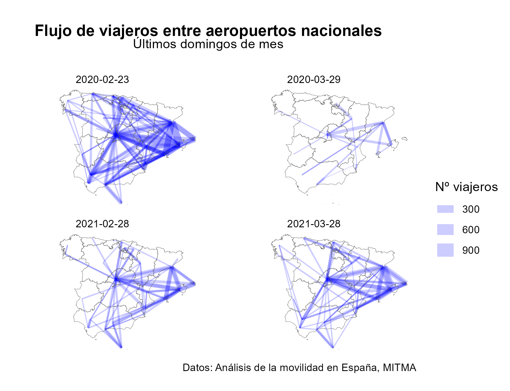
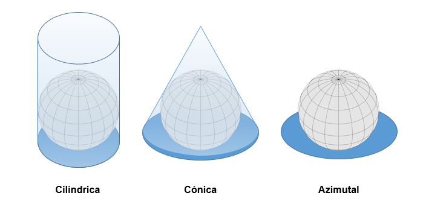

<center>


</center>

**Objetivos de aprendizaje**

**¿Por dónde empezamos? Recursos interesantes**

Libros de referencia:

-   [Spatial Data Science with applications in
    R](https://keen-swartz-3146c4.netlify.app/)

-   [Geocomputation with R](https://geocompr.robinlovelace.net/)

-   [Displaying time series, spatial and space-time data with
    R](https://oscarperpinan.github.io/bookvis/)

Recursos de estadísitca espacial en R:

-   [rspatial](https://rspatial.org/)
-   [R-spatial](https://r-spatial.org/projects/)

Otros recursos web interesantes:

-   Libro de Ruben
-   Rositter
-   Libro Hengl
-   Libro de Páez

<!-- La idea es que en los apuntes el código vaya oculto y luego se lo pasamos. ¿Te parece bien? -->

# La revolución de los geodatos


Que estamos en la la *era del dato*, que los *datos son el petroleo del siglo
XXI* y que estamos rodeados de datos es una cuestión que ya hemos hecho
inherente a nosotros. Estamos en el momento del dato, donde la profesión de Data
Scientist se ha convertido en la *profesión más sexy del siglo XXI* según
vaticinó en 2012 *Harvard Business Review*. Cada segundo se producen 1,7 MB de
datos/persona y cada año esta cifra se duplica se duplica.

Este incremento exponencial de los datos ha sido posible, sin duda, gracias al
desarrollo de la tecnología, los ordenadores, los teléfonos móviles móviles, los
satélites, internet, etc... y asociado a estas nuevas herramientas, se ha
producido una lluvia sin precedentes hasta el momento de datos espaciales o
datos georreferenciados. Cada teléfono inteligente tiene un receptor de
posicionamiento global (GPS) y una multitud de sensores en dispositivos que van
desde satélites y vehículos semiautónomos hasta científicos ciudadanos que miden
incesantemente cada parte del mundo. La tasa de datos producidos es abrumadora.
Un vehículo autónomo, por ejemplo, puede generar 100 GB de datos por día (The
Economist, 2016). Los datos de teledetección de satélites se han vuelto
demasiado grandes para analizar los datos correspondientes con una sola
computadora.

Esta **revolución de los geodatos** y el **análisis de los datos espaciales** no
sólo impulsa la demanda de hardware informático de alto rendimiento y software
escalable y eficiente para manejar y extraer la señal del ruido, lo que se
conoce como **Geocomputación**, sino que ha dado lugar una nueva rama de
conocimiento, *Spatial Data Scicene* (SDS) o **Ciencia de Datos Espaciales**.

<!-- Aquí se podrían representar los datos de movilidad -->

Como ejemplo, el Ministerio de Transportes, Movilidad y Agenda Urbana llevó a
cabo durante los años 2020 y 2021 el denominado [Estudio de movilidad con Big
Data](https://www.mitma.gob.es/ministerio/covid-19/evolucion-movilidad-big-data),
cuya fuente principal de datos fue el posicionamiento de los teléfonos móviles
anonimizado. Estos datos permiten por ejemplo analizar la movilidad entr
diversas zonas del territorio español de manera diaria:



# Geocomputación y R-spatial


## ¿Qué es la geocomputación?

La geocomputación es un término relativamente nuevo pero influenciado por otros
términos clásicos. La geocomputación puede definirse de manera sencilla como
*"el proceso de aplicar tecnologías de computación a problemas geográficos"*
[@rees1998]. @Openshaw_Abrahart_2000 aporta más elementos formales a esta
definición destacando que *"la geocomputación trata sobre los diferentes tipos
de geodatos, y sobre el desarrollo de geo-herramientas relevantes en un contexto
científico"*.

La geocomputación, por tanto, trata de aplicar técnicas de análisis y estudio de
datos a un tipo de datos específicos: los datos espaciales.

La geocomputación está muy relacionada con otros términos como los Sistema de
información geográfica (GIS, del inglés, Geographic Information Systems), y con
diversos tipos de campos científicos, como las Geociencias, las Ciencias
atmosféricas y climáticas, la Geoinformática, la Topología, la Ecología y las
Ciencia de datos geográficos (GDS, Geographic Data Science).

Cada término comparte un énfasis en un enfoque **científico** (que implica
reproducible y falsable) influenciado por los GIS, aunque sus orígenes y
principales campos de aplicación difieren. La geocomputación es ámpliamente
utilizada en ámbitos como la sociología, análisis político o el desarrollo de
aplicaciones para móviles.

Por tanto, usamos geocomputación como un sinónimo aproximado que encapsula a
todas las ciencias que buscan usar datos geográficos para trabajos científicos
aplicados.

## R y R-spatial

# Estadística espacial


<!-- (lo tengo literal del artículo mio de AHEPE, resumir) -->

La estadística espacial reconoce y aprovecha la ubicación espacial de los datos
a la hora de diseñar, recopilar, gestionar, analizar y mostrar las
observaciones. Éstas son generalmente **dependientes**, si bien existen modelos
espaciales a disposición del investigador que permiten tratar con dicha
dependencia espacial a la hora de llevar a cabo labores de predicción. La
estadística espacio-temporal incorpora, además, el tiempo y su interacción con
el espacio como argumento de ayuda en tales labores predictivas.

Las mediciones y modelos espaciales están presentes, sorprendentemente, en una
amplia variedad de disciplinas científicas. Los orígenes de la vida humana
vinculan los estudios de la evolución de las galaxias, la estructura de las
células biológicas y los patrones de asentamiento arqueológicos. Los ecologistas
estudian las interacciones entre plantas y animales. Silvicultores y
agricultores necesitan investigar las variaciones que se producen en el terreno
para sus experimentos. La estimación de las precipitaciones y de las reservas de
oro y petróleo es de vital importancia económica. Estos son, entre otros, buenos
ejemplos de la importancia del espacio (espacio-tiempo en su caso) en el mundo
de la Ciencia.

En todo caso, la geología, la edafología, el tratamiento de imágenes, la
epidemiología, la agronomía, la ecología, la silvicultura, la astronomía, el
estudio de la atmósfera, la economía, o simplemente, cualquier disciplina que
trabaje con datos espaciales recopilados de diferentes lugares y en distintos
instantes temporales, necesita del desarrollo de modelos geoestadísticos que
indiquen la estructura e intensidad de la dependencia espacial y/o
espacio-temporal presente en los fenómenos que comprenden.

Sin embargo, el estudio de la **variabilidad espacial**, y sobre todo
espacio-temporal, es una disciplina relativamente nueva en el marco de la
Estadística, lo que explica la escasez de instrumentos de estadística espacial
30 años atrás. En los últimos 10 años ha habido una creciente toma de conciencia
de esta necesidad, habiéndose realizado un gran esfuerzo por buscar herramientas
adecuadas y útiles a tales efectos. Y todo ello porque utilizar modelos
espaciales o espacio-temporales para caracterizar y explotar la dependencia
espacial (o espacio-temporal) de un conjunto de observaciones tiene importantes
ventajas:

1.  Modelos más generales, ya que, en la mayoría de los casos, los modelos
    clásicos que no tienen en consideración la dimensión espacial o la
    interacción de las dimensiones espacial y temporal son un caso particular de
    un modelo espacial o espacio-temporal.

2.  Estimaciones más eficientes: de la tendencia, de los efectos de las
    variables explicativas, de promedios regionales,...

3.  Mejora de las predicciones: más eficientes, con propiedades de extrapolación
    más estables,...

4.  La variación espacial no explicada en la estructura de la media debe ser
    absorbida por la estructura del error, por lo que un modelo que incorpore la
    dependencia espacial puede decirse que está protegido frente a una mala
    especificación de este tipo. Esto, en muchos casos, tiene como resultado una
    simplificación en la especificación de la tendencia; en general, los modelos
    con dependencia espacial suelen tener una descripción más parsimoniosa (en
    ocasiones con muchos menos parámetros) que los clásicos modelos de
    superficie de tendencia.

Estas mejoras de la estadística espacial y espacio-temporal, junto con el fuerte
y reciente desarrollo de los Sistemas de Información Geográfica o GIS
(Geographic Information System), han propiciado que en la actualidad exista una
importante motivación por la búsqueda de herramientas espaciales o
espacio-temporales.

## Antes de continuar... dependencia espacial.

Frecuentemente los datos tienen una componente espacial y/o temporal asociada a
ellos y es de esperar que datos cercanos en el espacio o en el tiempo sean más
semejantes que aquellos que están más alejados; en cuyo caso **no** deben ser
modelados como estadísticamente independiente, sino que habrá que tomar en
cuenta esa dependencia espacial o espacio-temporal.

De forma natural y de acuerdo a la Ley Tobler (1973) surge la idea de que los
datos cercanos en el espacio o en el tiempo serán más similares y estarán más
correlacionados entres sí que aquellos que están más lejanos. Además, esta
correlación disminuye al aumentar la separación entre ellos, por lo que se puede
pensar en la presencia de una dependencia espacial o espacio-temporal. Esto da
lugar al concepto de proceso espacial o espacio-temporal.

Si los datos no exhiben dependencia espacial no tiene sentido aplicar las
herramientas de estadística espacial. Veamos un ejemplo simulado de unos datos
que muestras dependencia espacial y otros puramente aleatorios.


```
#> 'RandomFields' will use OMP
```


Comentar


## Datos espaciales

Los **datos espaciales**, también conocidos como datos **geoespaciales**, son
aquellos datos relacionados o que contienen información de una localización o
área geográfica de la superficie de la Tierra.

La forma más intuitiva de representar los datos espaciales es a través de un
mapa.

    <!-- Propuesta: mapa temático cualquiera con poco código para empezar como el libro de SDS  https://keen-swartz-3146c4.netlify.app/intro.html#a-first-map  -->
    <!--    Y comentar algunas características de los datos espaciales que luego se explican. -->


```r
# Mapa de porcentaje de mujeres en Castilla-La Mancha

library(mapSpain)

# Datos de población
pob <- mapSpain::pobmun19


# Datos en forma de tabla, sin información en formato espacial
head(pob)
#>   cpro provincia cmun      name  pob19   men women
#> 1   02  Albacete  001 Abengibre    790   379   411
#> 2   02  Albacete  002    Alatoz    519   291   228
#> 3   02  Albacete  003  Albacete 173329 84687 88642
#> 4   02  Albacete  004  Albatana    692   356   336
#> 5   02  Albacete  005   Alborea    658   337   321
#> 6   02  Albacete  006  Alcadozo    654   363   291

# Porcentaje
pob$porc_mujeres <- pob$women / pob$pob19

# Datos espaciales
geo <- esp_get_munic(region = "Castilla-La Mancha")

# Estos datos tienen una columna (geometry) con coordenadas.
head(geo)
#> Simple feature collection with 6 features and 7 fields
#> Geometry type: POLYGON
#> Dimension:     XY
#> Bounding box:  xmin: -2.18037 ymin: 38.5441 xmax: -1.31112 ymax: 39.35597
#> Geodetic CRS:  ETRS89
#>     codauto        ine.ccaa.name cpro ine.prov.name cmun      name LAU_CODE
#> 76       08 Castilla - La Mancha   02      Albacete  001 Abengibre    02001
#> 69       08 Castilla - La Mancha   02      Albacete  002    Alatoz    02002
#> 119      08 Castilla - La Mancha   02      Albacete  003  Albacete    02003
#> 106      08 Castilla - La Mancha   02      Albacete  004  Albatana    02004
#> 83       08 Castilla - La Mancha   02      Albacete  005   Alborea    02005
#> 81       08 Castilla - La Mancha   02      Albacete  006  Alcadozo    02006
#>                           geometry
#> 76  POLYGON ((-1.58316 39.20446...
#> 69  POLYGON ((-1.40607 39.12384...
#> 119 POLYGON ((-2.0562 38.88697,...
#> 106 POLYGON ((-1.54055 38.61066...
#> 83  POLYGON ((-1.38514 39.35429...
#> 81  POLYGON ((-2.15635 38.71074...

# Une ambos datos
geo_pob <- merge(geo,
  pob,
  by = c("cpro", "cmun"),
  all.x = TRUE
)

# Mapa básico
plot(geo_pob["porc_mujeres"],
  # Cambiamos titulo
  main = "Castilla-La Mancha: % mujeres (2019)",

  # Cambiamos la paleta de colores para hacerlo mas atractivo
  border = NA,
  pal = hcl.colors(12, "RdYlBu")
)
```


## Clasificación de datos espaciales

Tal y como acabamos de señalar y de acuerdo con Schabenberger y Gotway (2005, p.
6), debido a que los datos espaciales surgen en una gran variedad de campos y
aplicaciones, también hay una gran variedad de tipos de datos espaciales,
estructuras y escenarios. Por tanto, una clasificación exhaustiva de los datos
espaciales sería un reto muy difícil y hemos apostado por una clasificación
general, simple y útil de datos espaciales proporcionada por @cressie1993.

La **clasificación** de Cressie de datos espaciales se basa en la naturaleza del
dominio espacial en estudio. Dependiendo de esto, podemos tener: datos
geoestadísticos, datos de patrones de puntos y datos latice.

Siguiendo a @cressie1993, sea $s ∈ ℝ\^d$ una localización en un espacio Euclideo
$d-$dimensional y ${Z(s)∶ s ∈ ℝ\^d}$ una función aleatoria espacial, donde $Z$
representa el atributo en el cual estamos interesados:

1.  **Datos geoestadísticos:** Surgen cuando el dominio en estudio es **conjunto
    y fijo** $D$. Es decir: (i) $Z(s)$ se puede observar en cualquier punto del
    dominio (continuo); y (ii) los puntos en $D$ no son estocásticos (son fijos,
    $D$ es el mismo para todas las realizaciones de la función aleatoria
    espacial ).

    Algunos ejemplos de datos geoestadísticos son el nivel de un contaminante en
    una ciudad, los valores de precipitación o temperatura del aire en un país,
    las concentraciones de metales pesados en la capa superior del suelo de una
    región, etc.

    Es obvio que, al menos en teoría, el nivel de un contaminante específico
    podría medirse en cualquier lugar de la ciudad; Lo mismo puede decirse de
    las mediciones de precipitaciones o temperaturas del aire en un país o
    concentraciones de un metal pesado en una región.

    Sin embargo, en la práctica, no es posible una observación exhaustiva del
    proceso espacial. Por lo general, el proceso espacial se observa en un
    conjunto de ubicaciones (por ejemplo, el nivel de un contaminante específico
    en una ciudad se observa en los puntos donde están ubicadas las estaciones
    de monitoreo) y, basado en tales valores observados, el análisis
    geoestadístico reproduce el comportamiento de el proceso espacial en todo el
    dominio de interés.

    En el análisis geoestadístico lo más importante es cuantificar la
    correlación espacial entre observaciones (a través de la herramienta básica
    en geoestadística, el semivariograma) y utilizar esta información para
    lograr los objetivos anteriores.


```r
# ejemplo
```

2.  **Datos reticulares**: Surgen cuando: (i) el dominio bajo estudio $D$ es
    **discreto**, es decir, $Z(s)$ puede observarse en una serie de ubicaciones
    fijas que pueden enumerarse. Estas ubicaciones pueden ser puntos o regiones,
    pero generalmente son códigos postales, pistas censales, vecindarios,
    provincias, países, etc., y los datos en la mayoría de los casos son datos
    agregados espacialmente sobre estas áreas. Aunque estas regiones pueden
    tener una forma regular, normalmente la forma que tienen es irregular, y
    esto, junto con el carácter espacialmente agregado de la datos, es por lo
    que los datos latice tambien se denominan datos regionales. Y (ii) las
    ubicaciones en $D$ no son estocásticas. Por supuesto, un concepto clave en
    el análisis de los datos lattice es el **vecindario**.

    Algunos ejemplos de reticulares incluyen la tasa de desempleo por estados,
    los datos de delincuencia por comarcas, rendimientos agrícolas en parcelas,
    precios medios de la vivienda por provincias, etc.


```r
# ejemplo
```

3.  **Procesos de puntos:** Mientras que en los datos geoestadísticos y
    reticulares el dominio $D$ es fijo, en los datos de patrones puntuales el
    dominio es discreto o continuo, pero **aleatorio**. Los patrones de puntos
    surgen cuando el atributo bajo estudio es la ubicación de los eventos
    (observaciones). Es decir, el interés radica en dónde ocurren eventos de
    interés.

    Algunos ejemplos de patrones de puntos son la ubicación de incendios en una
    región española, la ubicación de los árboles en un bosque o la ubicación de
    nidos en una colonia de aves reproductoras, la localización de los delitos
    en una ciudad, entre muchas otras.

    En estos En los casos, es obvio que D es aleatorio y los puntos de
    observación no dependen del investigador. El principal objetivo del análisis
    de patrones de puntos es determinar si la ubicación de los eventos tiende a
    exhibir un patrón sistemático sobre el área en estudio o, por el contrario,
    son aleatoriamente repartido.

    Más concretamente, nos interesa analizar si la ubicación de los eventos es
    completamente aleatorio espacialmente (la ubicación donde ocurren los
    eventos no se ve afectada por la ubicación de otros eventos), uniforme o
    regular (cada punto está tan lejos de todos sus vecinos como sea posible) o
    agrupados o agregados (la ubicación de los eventos se concentra en grupos).


```r
# ejemplo
```

<!-- [**Los formatos**]{style="color:red"} más comunes de datos espaciales son -->

<!-- vectores y ráster. -->

<!-- [**Diego**]{style="color:red"} -->

# Formatos de datos espaciales

## Tipos de ficheros

<!-- Vectores y Rasters, el titulo está ya incluido en el child -->


En el ámbito del análisis espacial en **R**, se pueden clasificar los **datos**
o **el formato?, pregunto sólo** espaciales en función del modelo de datos
[@Lovelance_et_al_2019]. Se pueden distinguir dos tipos de modelos de datos:

## Datos de vectores

Este modelo está basado en puntos georeferenciados. Los puntos pueden
representar localizaciones específicas, como la localización de edificios:


```r

library(ggplot2)
library(sf)


# Hospitales en Toledo segun Eurostat
hosp_toledo <- st_read("data/hosp_toledo.geojson", quiet = TRUE)

# Plot
ggplot() +
  geom_sf(
    data = hosp_toledo, aes(fill = "Centros Sanitarios"),
    color = "blue"
  ) +
  labs(
    caption = "Datos: Eurostat",
    title = "Hospitales y Centros de Salud en Toledo",
    fill = ""
  ) +
  theme_minimal() +
  theme(legend.position = "bottom")
```


Estos puntos también pueden estar conectados entre sí, de manera que formen
geometrías más complejas, como líneas y polígonos:


```r

tajo <- st_read("data/tajo_toledo.shp", quiet = TRUE)
toledo <- st_read("data/toledo_ciudad.gpkg", quiet = TRUE)


ggplot(toledo) +
  geom_sf(fill = "cornsilk2") +
  geom_sf(data = tajo, col = "lightblue2", lwd = 2, alpha = 0.7) +
  geom_sf(data = hosp_toledo, col = "blue") +
  coord_sf(
    xlim = c(-4.2, -3.8),
    ylim = c(39.8, 39.95)
  ) +
  theme_minimal() +
  labs(title = "Ciudad de Toledo")
```


En el ejemplo anterior, el río Tajo está representado como una línea (sucesión
de puntos unidos entre sí) y la ciudad de Toledo como un polígono (línea de
puntos cerrada formando un continuo). A modo ilustrativo, podemos observar la
descomposición en puntos de todos los datos espaciales representados en el
gráfico anterior.


## Datos raster

Los datos ráster son datos representandos en una rejilla rectangular de píxeles
(denomindada **matriz**) que se puede visualizar en diversos dispositivo de
representación. El caso más cotidiano de un ráster es una fotografía, donde la
imagen se representa como una serie de celdas, determinadas por la resolución de
la imagen (número total de píxeles, determinados como nº de píxeles en cada fila
por nº de píxeles en cada columna) y el color que presenta cada uno de estos
píxeles.

En el ámbito de los datos espaciales, la definición es muy similar. Un archivo
ráster está formado por una malla regular de píxeles georreferenciada:


```r

library(raster)

elev <- raster("data/Toledo_DEM.tiff")
plot(elev, main = "Elevación de la provincia de Toledo")

# Mostramos el grid
pols <- rasterToPolygons(elev)
plot(pols, add = TRUE, border = "grey90")

# Añadimos la provincia
Tol_prov <- st_read("data/Toledo_prov.gpkg", quiet = TRUE)

# Si queremos solamente la forma en sf, usamos st_geometry
plot(st_geometry(Tol_prov), add = TRUE)
```


En el ejemplo anterior, el archivo ráster tiene únicamente una capa (ESP_alt).
Eso implica que cada píxel tiene asociado un único valor, en este caso, la
altitud media del terreno observada en cada píxel o celda.


Table: Datos de un ráster (detalle)

|         x|    y| Toledo_DEM|
|---------:|----:|----------:|
| -5.391667| 40.3|   1498.312|
| -5.358333| 40.3|   1701.125|
| -5.325000| 40.3|   1825.312|
| -5.291667| 40.3|   1739.062|
| -5.258333| 40.3|   1756.062|
| -5.225000| 40.3|   1659.688|
| -5.191667| 40.3|   1607.375|
| -5.158333| 40.3|   1809.562|
| -5.125000| 40.3|   1874.625|
| -5.091667| 40.3|   1691.312|
| -5.058333| 40.3|   1511.500|
| -5.025000| 40.3|   1207.000|
| -4.991667| 40.3|   1160.125|
| -4.958333| 40.3|   1396.125|
| -4.925000| 40.3|   1624.125|


Los rásters pueden contener varias capas (o layers), de manera que cada píxel
puede tener asociados varios valores. Volviendo al ejemplo de la fotografía, en
un modelo simple de color RGB cada píxel lleva asociado 3 valores (rojo, verde o
azul), de manera que al combinar las tres capas se puede definir un color
distinto en cada píxel.

En el siguiente ejemplo vamos a usar una imagen de mapa georreferenciada, como
las proporcionadas por servicios de mapas online, para analizar su composición.


El ráster se puede descomponer en las tres capas RGB mencionadas anteriormente:


Table: Datos de un ráster multicapa (detalle)

|         x|        y|    lyr.1|    lyr.2|    lyr.3|
|---------:|--------:|--------:|--------:|--------:|
| -5.466412| 40.34418| 215.2128| 208.1061| 190.5410|
| -5.463875| 40.34418| 228.0369| 223.1854| 211.2115|
| -5.461338| 40.34418| 229.3495| 224.3414| 213.4325|
| -5.458800| 40.34418| 215.8592| 208.8660| 191.2922|
| -5.456263| 40.34418| 219.2696| 212.8231| 196.6812|
| -5.453725| 40.34418| 235.0954| 231.4222| 222.4115|
| -5.451188| 40.34418| 240.3514| 237.9094| 231.4736|
| -5.448651| 40.34418| 237.2358| 233.7561| 226.2005|
| -5.446113| 40.34418| 229.9570| 225.3262| 214.6201|
| -5.443576| 40.34418| 226.7812| 221.6796| 209.2929|
| -5.441038| 40.34418| 222.3593| 216.5022| 202.0188|
| -5.438501| 40.34418| 220.9312| 214.9060| 200.0306|
| -5.435964| 40.34418| 224.7755| 219.2661| 206.2156|
| -5.433426| 40.34418| 222.0479| 216.0124| 201.6103|
| -5.430889| 40.34418| 225.0516| 219.8074| 207.0263|


##  Sistema de Referencia de Coordenadas (CRS)


Un sistema de referencia de coordenadas (o CRS por sus siglas en inglés,
**Coordinate Reference System**) permite relacionar datos espaciales con su
localización en la superficie terrestre. Los CRS constituyen por tanto un
aspecto fundamental en el análisis y representación de datos espaciales, ya que
nos permiten identificar con exactitud la posición de los datos sobre el globo
terráqueo.

Así mismo, cuando se trabaja con datos espaciales provenientes de distintas
fuentes de información, es necesario comprobar que dichos datos se encuentran
definidos en el mismo CRS:


En el ejemplo anterior, ambos puntos (verde y rojo) presentan los mismos valores
de coordenadas en los ejes X e Y, en este caso las correspondientes a la ciudad
de Toledo.

Sin embargo, presentan distintos CRS. Por este motivo, al representar ambos
puntos en un mapa, se observa que no se están refiriendo a la misma localización
geográfica. Esto es así porque el CRS define la referencia (punto x=0 e y =0) y
las unidades de los ejes (grados, metros, millas).

Como conclusión, **además de disponer de las coordenadas de los datos
espaciales, es necesario conocer el CRS en el que están definidos para conocer
de manera exacta su localización geográfica.** Además, nótese que para cualquier
**análisis de datos espaciales** es necesario que todos los geodatos **se
encuentren referenciados en el mismo CRS**. Esto se consigue transformando (o
proyectando) los datos a un CRS común, nunca sobreescribiendo el CRS de los
mismos.

### Tipos de CRS

A continuación se definen los dos grandes tipos de CRS, los CRS geográficos y
los CRS proyectados.

#### CRS geográficos

Los CRS geográficos son aquellos en los que los parámetros empleados para
localizar una posición espacial son la latitud y la longitud:

-   **Latitud**: Es la distancia angular expresada en grados sobre el plano
    definido por el ecuador terrestre. Determina la posición sobre de una
    localización en el eje Norte-Sur de la Tierra y toma valores en el rango
    $[-90º,90º]$ . Las líneas imaginarias determinadas por una sucesión de
    puntos con la misma latitud a lo largo del eje Este-Oeste se denominan
    **paralelos**:


-   **Longitud**: Es la distancia angular expresada en grados sobre el plano
    definido por el meridiano de Greenwich. Determina la posición sobre de una
    localización en el eje Este-Oeste de la Tierra y toma valores en el rango
    $[-180º,180º]$ . Las líneas imaginarias determinadas por una sucesión de
    puntos con la misma longitud a lo largo del eje Este-Oeste se denominan
    **meridianos**:


Es muy importante destacar que en un sistema de coordenadas geográfico, es
decir, basado en latitudes y longitudes, las **distancias** entre dos puntos
representan **distancias angulares**. Por ejemplo, la distancia entre el
meridiano de Greenwich y el meridiano correspondiente a la longitud 20º siempre
es de +20º. Sin embargo, debido a la forma esférica de la Tierra, la longitud en
metros entre ambos meridianos no es constante:


#### CRS proyectados

La representación de formas tridimensionales en un soporte plano (dos
dimensiones) presenta algunos retos. Por ello, es habitual trabajar con
proyecciones de mapas.

Una proyección geográfica es un método para reducir la superficie de la esfera
terrestre a un sistema cartesiano de dos dimensiones. Para ello, es necesario
transformar las coordenadas longitud y latitud en coordenadas cartesianas x e y.

Es importante destacar que las proyecciones pueden incluir un punto de origen
(X=0, Y=0) y unas unidades de distancia (habitualmente metros) específicas. Por
ejemplo, la **proyección cónica equiáreas de Albers** (específica para Estados
Unidos) define su punto de referencia (0,0) en la latitud 40º N y longitud 96º,
y la unidad de variación están definida en metros. De ahí la importancia de
conocer el CRS de los datos geográficos, como se expuso al principio de este
tema.

Existen varias familias de proyecciones, que se pueden clasificar de diversas
maneras:

**Por tipo de superficie de proyección**

El proceso de trasladar puntos de una esfera a un plano puede plantearse de
manera práctica como el ejercicio de envolver una esfera con una superificie
plana (como una hoja de papel) y trasladar los puntos de la esfera de manera
lineal al punto de la superficie plana más cercano a ella.



A partir de este ejercicio, se plantean tres posibles soluciones, dependiendo
del tipo de superficie que se use para proyectar:

-   **Proyecciones cilíndricas**: Son aquellas proyecciones donde la superficie
    de proyección conforma un cilindro alrededor de la Tierra. Una de las
    proyecciones cilíndricas más conocidas es la **proyección de Mercator**.


-   **Proyecciones cónicas**: En este tipo de proyecciones, se plantea la
    superficie de proyección como una forma cónica. Como ejemplo, la
    **proyección cónica equiáreas de Albers** es una de las proyecciones que más
    suele usarse en la representación de mapas de América del Norte:

    

-   **Proyecciones acimutales o planares:** En este tipo de proyección se
    proyecta una porción de la Tierra sobre un plano que es tangente a la misma
    en el punto de referencia. Como ejemplos de proyecciones acimutales podemos
    destacar la **proyección ortográfica**:

    

**Por métrica a preservar**

Es importante tener en cuenta que cualquier proyección de la superficie de la
Tierra produce distorsiones en una o varias características geográficas. Como
ejemplos clásicos, la proyección de Mercator produce distorsiones del área
especialmente en aquellas regiones más cercanas a los polos (Groenlandia, que la
proyección de Mercator presenta una área similar a la de África, presenta menor
superificie real que Argelia). Otras de las métricas que suele verse
distorsionada son la **distancia** entre dos puntos geográficos, la
**dirección** o la **forma** de regiones de la Tierra.

A lo largo de la Historia se han desarrollado diversas proyecciones cuyo
objetivo es preservar alguna o varias de las propiedades mencionadas
anteriormente, sin embargo es importante destacar que **no existe una proyección
que sea capaz de preservar todas las métricas a la vez**.

Según la metrica a presevar, las proyecciones se pueden clasificar en:

-   **Proyecciones conformales:** Estas proyecciones intentan preservar los
    ángulos que se forman en la superficie terrestre. Por ejemplo, la proyección
    de Mercator representa ángulos rectos en las intersecciones de los paralelos
    y los meridianos.

    

-   **Proyecciones equivalentes**: Estas proyecciones preservan las proporciones
    de las áreas, provocando a su vez deformaciones en el resto de
    características, como la forma o los ángulos. La proyección acimutal
    equivalente de Lambers es un tipo de proyección equivalente.

    

-   **Proyecciones equidistantes:** Este tipo de proyección preserva la
    distancia entre dos puntos geográficos específicos. Por ejemplo, la
    proyección Plate carré preserva la distancia entre el Polo Norte y el Polo
    Sur.


-   **Proyecciones de compromiso**: Este tipo de proyección no intenta preservar
    ninguna métrica en concreto. En su lugar, se centran en intentar encontrar
    un equilibrio entre las diversas distorsiones que provocan para intentar dar
    una representación más o menos representativa de la superficie terrestre. La
    proyección de Winkel Tripel, usada en los mapas de National Geographic, es
    un ejemplo de proyección de compromiso.


En los anteriores ejemplos se ha añadido a cada proyección la **indicatriz de
Tissot**. Consiste en una serie de círculos imaginarios de igual área
distribuidos sobre la superficie esférica de la Tierra en determinados puntos.
De este manera, al presentar la indicatriz de Tissot en una proyección
específica, se puede entender de una manera intuitiva la distorsión provocada
por dicha proyección, ya que los círculos se ven distorsionados o preservados
según los parámetros y la naturaleza de la proyección en cuestión.

### Trabajando con proyecciones en R

Existe toda una serie de proyecciones predefinidas, identificadas mediante los
**códigos EPSG, ESRI, WKT** o proj4 (en desuso en R, pero todavía admitidos).
Existen varios recursos web donde se pueden consultar y seleccionar los códigos
correspondientes:

-   <https://epsg.io/>

-   <https://spatialreference.org/>

-   <https://proj.org/operations/projections/index.html>

El paquete `sf` permite obtener los parámetros de estas proyecciones mediante la
función `st_crs()`:


```r

library(sf)

# Ejemplo: EPSG WGS 84 (Sistema Global GPS): EPSG 4326

st_crs(4326)
#> Coordinate Reference System:
#>   User input: EPSG:4326 
#>   wkt:
#> GEOGCRS["WGS 84",
#>     DATUM["World Geodetic System 1984",
#>         ELLIPSOID["WGS 84",6378137,298.257223563,
#>             LENGTHUNIT["metre",1]]],
#>     PRIMEM["Greenwich",0,
#>         ANGLEUNIT["degree",0.0174532925199433]],
#>     CS[ellipsoidal,2],
#>         AXIS["geodetic latitude (Lat)",north,
#>             ORDER[1],
#>             ANGLEUNIT["degree",0.0174532925199433]],
#>         AXIS["geodetic longitude (Lon)",east,
#>             ORDER[2],
#>             ANGLEUNIT["degree",0.0174532925199433]],
#>     USAGE[
#>         SCOPE["unknown"],
#>         AREA["World"],
#>         BBOX[-90,-180,90,180]],
#>     ID["EPSG",4326]]

# Usando código ESRI North America Albers Equal Area Conic

st_crs("ESRI:102008")
#> Coordinate Reference System:
#>   User input: ESRI:102008 
#>   wkt:
#> PROJCRS["North_America_Albers_Equal_Area_Conic",
#>     BASEGEOGCRS["NAD83",
#>         DATUM["North American Datum 1983",
#>             ELLIPSOID["GRS 1980",6378137,298.257222101,
#>                 LENGTHUNIT["metre",1]]],
#>         PRIMEM["Greenwich",0,
#>             ANGLEUNIT["Degree",0.0174532925199433]]],
#>     CONVERSION["North_America_Albers_Equal_Area_Conic",
#>         METHOD["Albers Equal Area",
#>             ID["EPSG",9822]],
#>         PARAMETER["Latitude of false origin",40,
#>             ANGLEUNIT["Degree",0.0174532925199433],
#>             ID["EPSG",8821]],
#>         PARAMETER["Longitude of false origin",-96,
#>             ANGLEUNIT["Degree",0.0174532925199433],
#>             ID["EPSG",8822]],
#>         PARAMETER["Latitude of 1st standard parallel",20,
#>             ANGLEUNIT["Degree",0.0174532925199433],
#>             ID["EPSG",8823]],
#>         PARAMETER["Latitude of 2nd standard parallel",60,
#>             ANGLEUNIT["Degree",0.0174532925199433],
#>             ID["EPSG",8824]],
#>         PARAMETER["Easting at false origin",0,
#>             LENGTHUNIT["metre",1],
#>             ID["EPSG",8826]],
#>         PARAMETER["Northing at false origin",0,
#>             LENGTHUNIT["metre",1],
#>             ID["EPSG",8827]]],
#>     CS[Cartesian,2],
#>         AXIS["(E)",east,
#>             ORDER[1],
#>             LENGTHUNIT["metre",1]],
#>         AXIS["(N)",north,
#>             ORDER[2],
#>             LENGTHUNIT["metre",1]],
#>     USAGE[
#>         SCOPE["unknown"],
#>         AREA["North America - Canada and USA (CONUS, Alaska mainland)"],
#>         BBOX[23.81,-172.54,86.46,-47.74]],
#>     ID["ESRI",102008]]

# Usando proj4string: Robinson

st_crs("+proj=robin")
#> Coordinate Reference System:
#>   User input: +proj=robin 
#>   wkt:
#> PROJCRS["unknown",
#>     BASEGEOGCRS["unknown",
#>         DATUM["World Geodetic System 1984",
#>             ELLIPSOID["WGS 84",6378137,298.257223563,
#>                 LENGTHUNIT["metre",1]],
#>             ID["EPSG",6326]],
#>         PRIMEM["Greenwich",0,
#>             ANGLEUNIT["degree",0.0174532925199433],
#>             ID["EPSG",8901]]],
#>     CONVERSION["unknown",
#>         METHOD["Robinson"],
#>         PARAMETER["Longitude of natural origin",0,
#>             ANGLEUNIT["degree",0.0174532925199433],
#>             ID["EPSG",8802]],
#>         PARAMETER["False easting",0,
#>             LENGTHUNIT["metre",1],
#>             ID["EPSG",8806]],
#>         PARAMETER["False northing",0,
#>             LENGTHUNIT["metre",1],
#>             ID["EPSG",8807]]],
#>     CS[Cartesian,2],
#>         AXIS["(E)",east,
#>             ORDER[1],
#>             LENGTHUNIT["metre",1,
#>                 ID["EPSG",9001]]],
#>         AXIS["(N)",north,
#>             ORDER[2],
#>             LENGTHUNIT["metre",1,
#>                 ID["EPSG",9001]]]]
```

De esta manera, es posible proyectar un objeto `sf` mediante la función
`st_transform()`:


```r

# Usa datos del paquete mapSpain

library(giscoR)

paises <- gisco_get_countries()

# Comprobamos el CRS de estos datos
# Se puede almacenar en un objeto y usar posteriormente
st_crs(paises)
#> Coordinate Reference System:
#>   User input: EPSG:4326 
#>   wkt:
#> GEOGCS["WGS 84",
#>     DATUM["WGS_1984",
#>         SPHEROID["WGS 84",6378137,298.257223563,
#>             AUTHORITY["EPSG","7030"]],
#>         AUTHORITY["EPSG","6326"]],
#>     PRIMEM["Greenwich",0,
#>         AUTHORITY["EPSG","8901"]],
#>     UNIT["degree",0.0174532925199433,
#>         AUTHORITY["EPSG","9122"]],
#>     AUTHORITY["EPSG","4326"]]

# Plot
plot(st_geometry(paises), axes = TRUE)
```


```r

# Proyectamos a Mercator
# El eje cambia porque Mercator usa metros
paises_merc <- st_transform(paises, st_crs(3857))
plot(st_geometry(paises_merc), axes = TRUE)
```


```r

# Proyectamos a Robinson
paises_robin <- st_transform(paises, st_crs("+proj=robin"))
plot(st_geometry(paises_robin), axes = TRUE)
```


Como se comentó anteriormente, cuando se usan geodatos de diversas fuentes, es
necesario que todos presenten el mismo CRS. En este ejemplo se muestra lo que
ocurre si esto no se cumple:


```r
# Añadimos a este mapa puertos mundiales de giscoR

puertos <- gisco_get_ports()
plot(st_geometry(paises_robin), main = "Puertos en el mundo")
plot(st_geometry(puertos), add = TRUE, col = "red", pch = 20)
```


```r


# Ha habido algun error... Comprueba CRS

st_crs(puertos) == st_crs(paises_robin)
#> [1] FALSE

# Los puertos no están en Robinson! Proyectamos al mismo CRS
puertos_robin <- st_transform(puertos, st_crs(paises_robin))
plot(st_geometry(paises_robin), main = "Puertos en el mundo")
plot(st_geometry(puertos_robin), add = TRUE, col = "blue", pch = 20)
```


Como vemos, en el primer mapa los puertos se concentran en un único punto, dado
que no están referenciados en el mismo CRS. Tras proyectarlos, el mapa se
representa adecuadamente.

En otros paquetes, como `sp` o `raster`, existen funciones parecidas. Cuando
empleemos el paquete `sp` podemos usar las funciones `CRS()` y `spTransform()`:


```r

library(sp)

# Convertimos sf a sp
paises_sp <- as(paises, "Spatial")

# En sp podemos usar:
# CRS("+proj=robin")
#
# O también desde sf
# CRS(st_crs(paises_robin)$proj4string)


paises_sp_robin <- spTransform(paises_sp, CRS("+proj=robin"))
plot(paises_sp_robin)
```


En el caso de un objeto `raster`, podemos usar `crs()` y `projectRaster()`:


```r
library(raster)


# Extrae información de altitud para Paises Bajos
elev <- getData("alt", country = "NLD", path = tempdir())

plot(elev)
```


```r


# Transforma
elev_robinson <- projectRaster(elev, crs = crs("+proj=robin"))
plot(elev_robinson)
```


Por último, en el paquete `terra` las funciones correspondientes son `crs()` y
`project()`:


```r
library(terra)

# Convierte de raster a terra
elev_terra <- rast(elev)

plot(elev_terra)
```


```r

# Transforma
elev_terra_robinson <- terra::project(elev_terra, terra::crs(elev_terra))
plot(elev_terra_robinson)
```


### ¿Qué proyección uso?

El CRS adecuado para cada análisis depende de la localización y el rango
espacial de los datos. Un CRS adecuado para representar un mapa del mundo puede
no serlo para representar datos de zonas específicas de la Tierra. Los recursos
web mencionados anteriormente permiten la búsqueda de CRS por zona geográfica, y
adicionalmente en **R** existe el paquete `crsuggest` [@R-crsuggest] que nos
facilita la labor, sugiriendo el CRS más adecuado para cada zona:


```r
library(crsuggest)

# CRS para Paises Bajos

# Usando raster
sugerencias <- suggest_crs(elev)
```


Table: Tabla sugerencias, detalle

|crs_code |crs_name                                 |crs_type  | crs_gcs|crs_units |crs_proj4                                                                                                                                                                                                                        |
|:--------|:----------------------------------------|:---------|-------:|:---------|:--------------------------------------------------------------------------------------------------------------------------------------------------------------------------------------------------------------------------------|
|28992    |Amersfoort / RD New                      |projected |    4289|m         |+proj=sterea +lat_0=52.1561605555556 +lon_0=5.38763888888889 +k=0.9999079 +x_0=155000 +y_0=463000 +ellps=bessel +towgs84=565.2369,50.0087,465.658,-0.406857330322398,0.350732676542563,-1.8703473836068,4.0812 +units=m +no_defs |
|28991    |Amersfoort / RD Old                      |projected |    4289|m         |+proj=sterea +lat_0=52.1561605555556 +lon_0=5.38763888888889 +k=0.9999079 +x_0=0 +y_0=0 +ellps=bessel +towgs84=565.2369,50.0087,465.658,-0.406857330322398,0.350732676542563,-1.8703473836068,4.0812 +units=m +no_defs           |
|5651     |ETRS89 / UTM zone 31N (N-zE)             |projected |    4258|m         |+proj=tmerc +lat_0=0 +lon_0=3 +k=0.9996 +x_0=31500000 +y_0=0 +ellps=GRS80 +towgs84=0,0,0,0,0,0,0 +units=m +no_defs                                                                                                               |
|5649     |ETRS89 / UTM zone 31N (zE-N)             |projected |    4258|m         |+proj=tmerc +lat_0=0 +lon_0=3 +k=0.9996 +x_0=31500000 +y_0=0 +ellps=GRS80 +towgs84=0,0,0,0,0,0,0 +units=m +no_defs                                                                                                               |
|3812     |ETRS89 / Belgian Lambert 2008            |projected |    4258|m         |+proj=lcc +lat_0=50.797815 +lon_0=4.35921583333333 +lat_1=49.8333333333333 +lat_2=51.1666666666667 +x_0=649328 +y_0=665262 +ellps=GRS80 +towgs84=0,0,0,0,0,0,0 +units=m +no_defs                                                 |
|3447     |ETRS89 / Belgian Lambert 2005            |projected |    4258|m         |+proj=lcc +lat_0=50.797815 +lon_0=4.35921583333333 +lat_1=49.8333333333333 +lat_2=51.1666666666667 +x_0=150328 +y_0=166262 +ellps=GRS80 +towgs84=0,0,0,0,0,0,0 +units=m +no_defs                                                 |
|31370    |Belge 1972 / Belgian Lambert 72          |projected |    4313|m         |+proj=lcc +lat_0=90 +lon_0=4.36748666666667 +lat_1=51.1666672333333 +lat_2=49.8333339 +x_0=150000.013 +y_0=5400088.438 +ellps=intl +towgs84=-99.059,53.322,-112.486,0.419,-0.83,1.885,-1 +units=m +no_defs                       |
|31300    |Belge 1972 / Belge Lambert 72            |projected |    4313|m         |+proj=lcc +lat_0=90 +lon_0=4.35693972222222 +lat_1=49.8333333333333 +lat_2=51.1666666666667 +x_0=150000.01256 +y_0=5400088.4378 +ellps=intl +towgs84=-99.059,53.322,-112.486,0.419,-0.83,1.885,-1 +units=m +no_defs              |
|21500    |Belge 1950 (Brussels) / Belge Lambert 50 |projected |    4809|m         |+proj=lcc +lat_0=90 +lon_0=0 +lat_1=49.8333333333333 +lat_2=51.1666666666667 +x_0=150000 +y_0=5400000 +ellps=intl +pm=brussels +units=m +no_defs                                                                                 |
|23095    |ED50 / TM 5 NE                           |projected |    4230|m         |+proj=tmerc +lat_0=0 +lon_0=5 +k=0.9996 +x_0=500000 +y_0=0 +ellps=intl +towgs84=-89.5,-93.8,-123.1,0,0,-0.156,1.2 +units=m +no_defs                                                                                              |


```r
# Probamos sugerencia
crs_suggest <- suggest_crs(elev, limit = 1)

elev_suggest <- projectRaster(elev, crs = raster::crs(crs_suggest$crs_proj4))

plot(elev_suggest)
```


```r

# Ejemplo con sf: China

china <- gisco_get_countries(country = "China")
plot(st_geometry(china), axes = TRUE)
```


```r

china_crs <- suggest_crs(china, limit = 1)


china_suggest <- st_transform(
  china,
  st_crs(as.integer(china_crs$crs_code))
)


plot(st_geometry(china_suggest), axes = TRUE)
```


# Aplicaciones


<!-- Renta -->


## Renta media por municipios

Esta sección presenta un caso de uso en el que aprenderemos a realizar las
siguientes tareas básicas:

-   Importar datos tabulares y datos espaciales.

-   Realizar un tratamiento de limpieza de datos y cruzar tablas.

-   Hacer mapas temáticos. Aprenderemos también algunas nociones básicas sobre
    cómo crear diferentes clases para un conjunto de datos continuo.

Para ello, partiremos de dos ficheros:

1.  Fichero `renta_municipio.csv`: Este fichero contiene información de la Renta
    Neta per cápita por municipios, distritos y secciones censales. Esta
    información se ha extraído del [Atlas de distribución de renta de los
    hogares](https://www.ine.es/experimental/atlas/experimental_atlas.htm)
    proporcionado por el INE, y ha sido tratado previamente para adaptar la
    información al presente ejercicio.

2.  Fichero `municipios.gpkg`: Es un fichero que contiene datos espaciales
    (polígonos) de los municipios en España en el año 2019. Se ha extraído del
    Instituto Geográfico Nacional (IGN) usando el paquete `mapSpain`.

El primer paso en cualquier tipo de análisis de datos es importar los datos al
software de tratamiento (en nuestro caso, R) y analizarlos para conocer el tipo
de información que contiene:


```r

# Usaremos paquetes del tidyverse
library(dplyr)
library(readr)


renta <- read_csv("data/renta_municipio.csv", na = ".")

head(renta)
#> # A tibble: 6 × 6
#>   Unidad                          `2019` `2018` `2017` `2016` `2015`
#>   <chr>                            <dbl>  <dbl>  <dbl>  <dbl>  <dbl>
#> 1 44001 Ababuj                        NA     NA     NA     NA     NA
#> 2 4400101 Ababuj distrito 01          NA     NA     NA     NA     NA
#> 3 4400101001 Ababuj sección 01001     NA     NA     NA     NA     NA
#> 4 40001 Abades                     11429  10731  10314   9816   9904
#> 5 4000101 Abades distrito 01       11429  10731  10314   9816   9904
#> 6 4000101001 Abades sección 01001  11429  10731  10314   9816   9904
```

Podemos comprobar que tenemos información para los años 2015 a 2019. Además, la
columna `Unidad` contiene un literal con el municipio o sección correspondiente.


```r
library(sf)

munis <- st_read("data/municipios.gpkg", quiet = TRUE)

head(munis)
#> Simple feature collection with 6 features and 7 fields
#> Geometry type: MULTIPOLYGON
#> Dimension:     XY
#> Bounding box:  xmin: -3.140179 ymin: 36.73817 xmax: -2.057058 ymax: 37.54579
#> Geodetic CRS:  ETRS89
#>   codauto ine.ccaa.name cpro ine.prov.name cmun      name LAU_CODE
#> 1      01     Andalucía   04       Almería  001      Abla    04001
#> 2      01     Andalucía   04       Almería  002  Abrucena    04002
#> 3      01     Andalucía   04       Almería  003      Adra    04003
#> 4      01     Andalucía   04       Almería  004 Albanchez    04004
#> 5      01     Andalucía   04       Almería  005 Alboloduy    04005
#> 6      01     Andalucía   04       Almería  006     Albox    04006
#>                             geom
#> 1 MULTIPOLYGON (((-2.775594 3...
#> 2 MULTIPOLYGON (((-2.787566 3...
#> 3 MULTIPOLYGON (((-3.051988 3...
#> 4 MULTIPOLYGON (((-2.181086 3...
#> 5 MULTIPOLYGON (((-2.572442 3...
#> 6 MULTIPOLYGON (((-2.128106 3...
```

Podemos comprobar que `munis` es un objeto que contiene Polígonos y varias
columnas, entre ellas dos especialmente relevantes: `cpro` y `cmun`, que
corresponden a los códigos de provincia y de municipio respectivamente. Podemos
comprobar que este código también se encuentra en nuestro dataset `renta`:


```r
# Miro un municipio: Noblejas

renta[grep("Noblejas", renta$Unidad), ]
#> # A tibble: 5 × 6
#>   Unidad                            `2019` `2018` `2017` `2016` `2015`
#>   <chr>                              <dbl>  <dbl>  <dbl>  <dbl>  <dbl>
#> 1 45115 Noblejas                     10591  10314   9751   9484   9124
#> 2 4511501 Noblejas distrito 01       11039  10717  10135   9711   9386
#> 3 4511501001 Noblejas sección 01001  11039  10717  10135   9711   9386
#> 4 4511502 Noblejas distrito 02       10276  10029   9475   9319   8938
#> 5 4511502001 Noblejas sección 02001  10276  10029   9475   9319   8938

munis[grep("Noblejas", munis$name), c("name", "cpro", "cmun")]
#> Simple feature collection with 1 feature and 3 fields
#> Geometry type: MULTIPOLYGON
#> Dimension:     XY
#> Bounding box:  xmin: -3.489824 ymin: 39.93003 xmax: -3.372611 ymax: 40.05017
#> Geodetic CRS:  ETRS89
#>          name cpro cmun                           geom
#> 4985 Noblejas   45  115 MULTIPOLYGON (((-3.44681 40...
```

En el caso de Noblejas, el código completo es 45115. Sin embargo, en el caso de
la tabla `renta`, debemos extraer ese valor del literal. Para ello debemos
manipular la columna y extraer la primera palabra de la columna `Unidad`:


```r

# Creo una función y la aplico a toda la columna
extrae_codigo <- function(x) {
  unlist(strsplit(x, " "))[1]
}


renta$codigo_ine <- sapply(as.character(renta$Unidad), extrae_codigo)

head(renta[c("Unidad", "codigo_ine")])
#> # A tibble: 6 × 2
#>   Unidad                          codigo_ine
#>   <chr>                           <chr>     
#> 1 44001 Ababuj                    44001     
#> 2 4400101 Ababuj distrito 01      4400101   
#> 3 4400101001 Ababuj sección 01001 4400101001
#> 4 40001 Abades                    40001     
#> 5 4000101 Abades distrito 01      4000101   
#> 6 4000101001 Abades sección 01001 4000101001
```

Ahora, es necesario crear la misma variable en `munis` para poder realizar el
cruce:


```r

munis$codigo_ine <- paste0(munis$cpro, munis$cmun)

head(munis[, c("name", "codigo_ine")])
#> Simple feature collection with 6 features and 2 fields
#> Geometry type: MULTIPOLYGON
#> Dimension:     XY
#> Bounding box:  xmin: -3.140179 ymin: 36.73817 xmax: -2.057058 ymax: 37.54579
#> Geodetic CRS:  ETRS89
#>        name codigo_ine                           geom
#> 1      Abla      04001 MULTIPOLYGON (((-2.775594 3...
#> 2  Abrucena      04002 MULTIPOLYGON (((-2.787566 3...
#> 3      Adra      04003 MULTIPOLYGON (((-3.051988 3...
#> 4 Albanchez      04004 MULTIPOLYGON (((-2.181086 3...
#> 5 Alboloduy      04005 MULTIPOLYGON (((-2.572442 3...
#> 6     Albox      04006 MULTIPOLYGON (((-2.128106 3...
```

Ya estamos listos para realizar el cruce. Además, seleccionaremos sólo las
columnas que vamos a usar, en este caso la del año 2019:


```r

munis_renta <- munis %>%
  left_join(renta) %>%
  select(name, cpro, cmun, `2019`)
```

**Cuando crucemos datos espaciales con datos no espaciales en R, es importante
que el primer dataset sea el que contiene los datos espaciales**. Esto es así
porque el objeto resultante "hereda" la clase del primer objeto. A modo de
ejemplo, si realizáramos el proceso poniendo los datos espaciales en el lado
derecho del join, los datos finales no serán espaciales:


```r

# Miramos la clase de munis_renta

class(munis_renta)
#> [1] "sf"         "data.frame"

# Es un sf, por tanto espacial

# ¿Que pasa si realizamos el cruce de la otra manera?
renta %>%
  left_join(munis) %>%
  select(name, cpro, cmun, `2019`) %>%
  class()
#> [1] "tbl_df"     "tbl"        "data.frame"

# Es un tibble o data.frame, pero no es espacial!
```

Una vez que tenemos los datos unidos podemos realizar algunos análisis básicos,
como la realización de un histograma


```r

library(ggplot2)

munis_renta %>%
  ggplot(aes(x = `2019`)) +
  geom_histogram(color = "darkblue", fill = "lightblue") +
  scale_x_continuous(labels = scales::label_number_auto()) +
  scale_y_continuous(labels = scales::label_percent()) +
  labs(
    y = "",
    x = "Renta neta media por persona (€)"
  )
```


Podemos observar que la renta presenta una distribución Gamma con un gran de
municipios concentrados en zonas medias de Renta y pocos municipios en tramos de
rentas altas. Como veremos más adelante, esta distribución va a afectar a la
información que transmite el mapa.

Vamos a realizar ahora un mapa de coropletas mostrando la distribución de la
renta usando los valores brutos de renta sin modificar:


```r

ggplot(munis_renta) +
  # Usamos geom_sf, y como aes() lo que queremos mostrar, en este caso, el
  # color del polígono representa la renta. Vamos a retirar los bordes con
  # color = NA
  geom_sf(aes(fill = `2019`), color = NA) +
  theme_minimal() +
  labs(
    title = "Renta neta media por persona",
    subtitle = "€",
    caption = "Datos: INE"
  )
```


Este primer mapa no es demasiado informativo, por los siguientes motivos:

-   Existe una serie de municipios para los que no tenemos datos.

-   La escala de color no es la más adecuada.

Vamos a probar a eliminar los municipios sin datos y a cambiar la escala de
color:


```r

munis_renta_clean <- munis_renta %>% filter(!is.na(`2019`))

ggplot(munis_renta_clean) +
  geom_sf(aes(fill = `2019`), color = NA) +
  # Cambiamos la paleta de colores, vamos a usar una paleta denominada Inferno,
  # ya incluida en base R con hcl.colors

  # Como son datos continuos, puedo usar Inferno
  scale_fill_gradientn(colours = hcl.colors(20, "Inferno", rev = TRUE)) +
  theme_minimal() +
  labs(
    title = "Renta neta media por persona",
    subtitle = "€",
    caption = "Datos: INE"
  )
```


Este mapa nos da algo más de información, y parece intuirse que las rentas más
altas se encuentran en zonas de País Vasco, Madrid y Cataluña. Sin embargo, el
hecho de que la distribución de los datos no sea normal está afectando a la
visualización.

Para intentar atajar este problema, podemos dividir nuestros datos en clases,
por ejemplo cuartiles o deciles. Existen varios métodos de clasificación de
datos, que en R se encuentran implementados en el paquete `classInt`. A
continuacíón vamos a plantear diversos métodos de clasificación y observar cómo
la "historia" que cuenta el mapa varía en función de dichas clases:


```r

library(classInt)


# Vamos a probar 3 métodos de clasificación: Deciles, Fisher and Jenks y Head/Tails
deciles <- classIntervals(munis_renta_clean$`2019`,
  style = "quantile", n = 10
)
plot(deciles, pal = hcl.colors(20, "Inferno"), main = "Deciles")
```


```r

fisher <- classIntervals(munis_renta_clean$`2019`,
  style = "fisher"
)
plot(fisher, pal = hcl.colors(20, "Inferno"), main = "Fisher-Jenks")
```


```r

headtails <- classIntervals(munis_renta_clean$`2019`, style = "headtails", thr = 0.5)

plot(headtails, pal = hcl.colors(20, "Inferno"), main = "Head/Tails")
```


Podemos observar lo siguiente:

-   El último decil de renta se corresponde a un rango de entre 15.000 y 25.000
    €.
-   El método por deciles proporciona unos grupos con valores de renta muy
    parecidos entre sí en los valores medios.
-   El método de Fisher-Jenks puede proporcionar unas clases con unos rangos más
    apropiados para los tramos altos de renta.
-   El método Head/Tails es el que propone rangos de renta más regulares en
    términos de distancia entre tramos.

Vamos ahora a realizar 3 mapas distintos, creando clases de renta según cada uno
de los métodos anteriormente mostrados:


```r
# Extraigo los valores de corte
breaks_d <- deciles$brks

# Y creo unas etiquetas básicas para cada clase
labels_d <- names(print(deciles,
  under = "<",
  over = ">",
  cutlabels = FALSE
))
#> style: quantile
#>          < 8935.6   8935.6 - 9662.2  9662.2 - 10352.8   10352.8 - 10918 
#>               656               656               655               654 
#>     10918 - 11462   11462 - 11998.6 11998.6 - 12651.4 12651.4 - 13475.8 
#>               655               658               656               655 
#> 13475.8 - 14618.4         > 14618.4 
#>               656               656

munis_renta_clean$Deciles <- cut(munis_renta_clean$`2019`,
  breaks = breaks_d,
  labels = labels_d,
  include.lowest = TRUE
)

ggplot(munis_renta_clean) +
  # Cambiamos la variable que usamos para crear el mapa
  geom_sf(aes(fill = Deciles), color = NA) +
  # Necesito cambiar el scale, ya no es continua
  scale_fill_manual(values = hcl.colors(length(labels_d),
    "Inferno",
    rev = TRUE
  )) +
  theme_minimal() +
  labs(
    title = "Renta neta media por persona",
    subtitle = "€",
    caption = "Datos: INE"
  )
```


Este mapa ya nos permite observar patrones geográficos, donde se ve una clara
diferencia entre la Comunidades Autónomas del Norte y las del Sur. Veamos una
representación distina usando otras clases diferentes:


```r

breaks_f <- fisher$brks
labels_f <- names(print(fisher,
  under = "<",
  over = ">",
  cutlabels = FALSE
))
#> style: fisher
#>            < 8439     8439 - 9273.5  9273.5 - 10027.5 10027.5 - 10746.5 
#>               311               654               683               755 
#> 10746.5 - 11436.5 11436.5 - 12130.5 12130.5 - 12873.5 12873.5 - 13658.5 
#>               841               834               723               574 
#>   13658.5 - 14557   14557 - 15590.5   15590.5 - 17144     17144 - 19351 
#>               506               333               219                93 
#>   19351 - 22848.5         > 22848.5 
#>                28                 3

munis_renta_clean$`Fisher-Jenks` <- cut(munis_renta_clean$`2019`,
  breaks = breaks_f,
  labels = labels_f,
  include.lowest = TRUE
)

ggplot(munis_renta_clean) +
  # Cambiamos la variable que usamos para crear el mapa
  geom_sf(aes(fill = `Fisher-Jenks`), color = NA) +
  scale_fill_manual(values = hcl.colors(length(labels_f),
    "Inferno",
    rev = TRUE
  )) +
  theme_minimal() +
  labs(
    title = "Renta neta media por persona",
    subtitle = "€",
    caption = "Datos: INE"
  )
```


Este segundo mapa (DHH CONCLUSIONES)


```r

breaks_h <- headtails$brks
labels_h <- names(print(headtails,
  under = "<",
  over = ">",
  cutlabels = FALSE
))
#> style: headtails
#>           < 11671.5  11671.5 - 13611.52 13611.52 - 15193.61 15193.61 - 16764.64 
#>                3556                1792                 773                 282 
#>  16764.64 - 18427.6  18427.6 - 19845.02 19845.02 - 21403.67 21403.67 - 23041.71 
#>                  93                  40                  14                   4 
#> 23041.71 - 24591.67          > 24591.67 
#>                   2                   1

munis_renta_clean$`Head-Tails` <- cut(munis_renta_clean$`2019`,
  breaks = breaks_h,
  labels = labels_h,
  include.lowest = TRUE
)

ggplot(munis_renta_clean) +
  # Cambiamos la variable que usamos para crear el mapa
  geom_sf(aes(fill = `Head-Tails`), color = NA) +
  scale_fill_manual(values = hcl.colors(length(labels_h),
    "Inferno",
    rev = TRUE
  )) +
  theme_minimal() +
  labs(
    title = "Renta neta media por persona",
    subtitle = "€",
    caption = "Datos: INE"
  )
```


(DHH CONCLUSIONES FINALES)
# Extensiones

# Referencias
